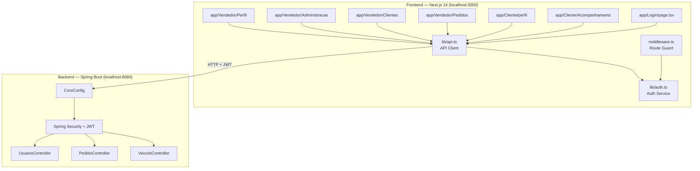
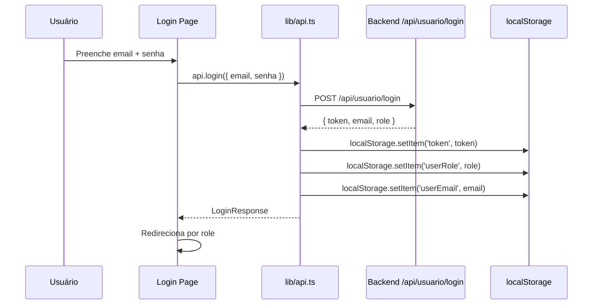
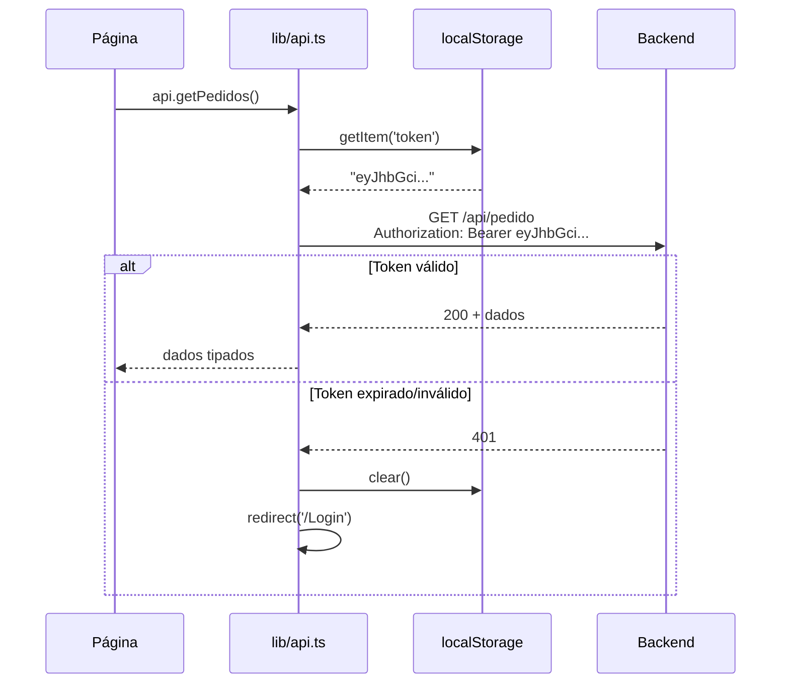

# Design Document — Integração Frontend-Backend Toyota Experience

## Visão Geral

Este documento descreve a arquitetura técnica para integrar o frontend Next.js 14 com o backend Spring Boot do projeto Toyota Experience. A integração substitui todos os dados mockados por chamadas reais à API REST, implementa autenticação JWT completa e adiciona proteção de rotas baseada em roles.

O trabalho está dividido em duas frentes paralelas:
- **Backend**: três mudanças pontuais (CORS, endpoints de ativação/desativação, enriquecimento do `PedidoResponse`)
- **Frontend**: criação do `API Client`, `Auth Service`, correção da página de Login e integração de todas as páginas existentes

---

## Arquitetura

### Diagrama de Componentes



### Fluxo de Autenticação JWT



### Fluxo de Requisição Autenticada



---

## Componentes e Interfaces

### 1. `lib/api.ts` — API Client

Serviço centralizado para todas as chamadas HTTP. Lê a URL base de `NEXT_PUBLIC_API_URL` (padrão: `http://localhost:8080`) e injeta automaticamente o token JWT do `localStorage`.

```typescript
// Estrutura do módulo lib/api.ts

const BASE_URL = process.env.NEXT_PUBLIC_API_URL ?? 'http://localhost:8080';

function getHeaders(): HeadersInit {
  const token = typeof window !== 'undefined'
    ? localStorage.getItem('token')
    : null;
  return {
    'Content-Type': 'application/json',
    ...(token ? { Authorization: `Bearer ${token}` } : {}),
  };
}

async function request<T>(path: string, options?: RequestInit): Promise<T> {
  const res = await fetch(`${BASE_URL}${path}`, {
    ...options,
    headers: { ...getHeaders(), ...options?.headers },
  });
  if (res.status === 401) {
    localStorage.clear();
    window.location.href = '/Login';
    throw new Error('Unauthorized');
  }
  if (!res.ok) throw new Error(`HTTP ${res.status}`);
  return res.json() as Promise<T>;
}

// Métodos exportados — agrupados por domínio:
// auth: login()
// usuario: getMe(), getUsuarios(), createUsuario(), updateUsuario(), deleteUsuario(),
//          ativarUsuario(), desativarUsuario()
// pedido: getPedidos(), getMeusPedidos(), getPedidoById(), createPedido(),
//         updatePedido(), deletePedido()
// veiculo: getVeiculos(), getVeiculoById(), getStatusHistorico(), updateStatusVeiculo()
```

### 2. `lib/auth.ts` — Auth Service

Encapsula toda a lógica de leitura/escrita do JWT no `localStorage`. Evita acesso direto ao `localStorage` espalhado pelas páginas.

```typescript
// Estrutura do módulo lib/auth.ts

export const AuthService = {
  getToken(): string | null,
  getRole(): UserRole | null,
  getEmail(): string | null,
  getUserId(): number | null,
  setSession(data: LoginResponse): void,   // armazena token + role + email
  clearSession(): void,                    // remove todas as chaves
  isAuthenticated(): boolean,
};
```

### 3. `middleware.ts` — Route Guard (Next.js)

Middleware do Next.js que intercepta todas as requisições e redireciona usuários não autenticados ou sem permissão antes de renderizar a página.

```typescript
// Lógica de proteção de rotas
// Rotas protegidas: /Cliente/*, /Vendedor/*
// Regras:
//   sem token → redirect /Login
//   CLIENTE → apenas /Cliente/*
//   VENDEDOR → /Vendedor/* exceto /Vendedor/Administracao
//   ADMIN → todos /Vendedor/*
```

**Decisão de design**: usar `middleware.ts` em vez de verificação por página porque centraliza a lógica, evita flash de conteúdo não autorizado e é executado no edge antes do React renderizar.

---

## Modelos de Dados

### Interfaces TypeScript (Frontend)

```typescript
// lib/types.ts

export type UserRole = 'CLIENTE' | 'VENDEDOR' | 'ADMIN' | 'IOT';

export type StatusFabricacao =
  | 'AGUARDANDO'
  | 'EM_FABRICACAO'
  | 'PINTURA'
  | 'CONTROLE_QUALIDADE'
  | 'CONCLUIDO'
  | 'ENTREGUE'
  | 'CANCELADO';

export interface LoginRequest {
  email: string;
  senha: string;
}

export interface LoginResponse {
  token: string;
  email: string;
  role: UserRole;
}

export interface UsuarioResponse {
  id: number;
  nome: string;
  email: string;
  dataNascimento: string;   // ISO date string
  role: UserRole;
  ativo?: boolean;          // campo novo — Requisito 10
}

export interface UsuarioRequest {
  nome: string;
  email: string;
  senhaHash: string;
  dataNascimento: string;
  role: UserRole;
}

export interface PedidoResponse {
  id: number;
  idCliente: number;
  idVendedor: number;
  dataPedido: string;       // ISO datetime string
  valorTotal: number;
  // campos enriquecidos — Requisito 9
  clienteNome?: string;
  veiculoModelo?: string;
  statusVeiculo?: StatusFabricacao;
}

export interface VeiculoResponse {
  id: number;
  idProduto: number;
  chassi: number;
  statusVeiculo: StatusFabricacao;
}

export interface StatusHistoricoResponse {
  id: number;
  veiculoId: number;
  status: StatusFabricacao;
  dataAtualizacao: string;
}
```

### Mapeamento StatusFabricacao → Label PT-BR

```typescript
export const STATUS_LABELS: Record<StatusFabricacao, string> = {
  AGUARDANDO:          'Compra realizada',
  EM_FABRICACAO:       'Início de produção',
  PINTURA:             'Qualidade',
  CONTROLE_QUALIDADE:  'Vistoria',
  CONCLUIDO:           'Pedido pronto',
  ENTREGUE:            'Entregue',
  CANCELADO:           'Cancelado',
};
```

### Mudanças no Backend

#### 1. Configuração CORS (`CorsConfig.java`)

```java
@Configuration
public class CorsConfig {
    @Bean
    public CorsConfigurationSource corsConfigurationSource() {
        CorsConfiguration config = new CorsConfiguration();
        config.setAllowedOrigins(List.of("http://localhost:3000"));
        config.setAllowedMethods(List.of("GET","POST","PUT","PATCH","DELETE","OPTIONS"));
        config.setAllowedHeaders(List.of("Authorization","Content-Type","Accept"));
        config.setAllowCredentials(true);

        UrlBasedCorsConfigurationSource source = new UrlBasedCorsConfigurationSource();
        source.registerCorsConfiguration("/**", config);
        return source;
    }
}
```

**Decisão**: usar `CorsConfigurationSource` como bean em vez de `@CrossOrigin` por controller, pois centraliza a configuração e é integrado ao Spring Security.

#### 2. Campo `ativo` na entidade `Usuario`

```java
// Adicionar em Usuario.java
@Column(nullable = false)
private boolean ativo = true;
```

#### 3. Endpoints de ativação/desativação (`UsuarioController.java`)

```java
@PatchMapping("/{id}/ativar")
@PreAuthorize("hasRole('ADMIN')")
public ResponseEntity<UsuarioResponse> ativarUsuario(@PathVariable Long id) { ... }

@PatchMapping("/{id}/desativar")
@PreAuthorize("hasRole('ADMIN')")
public ResponseEntity<UsuarioResponse> desativarUsuario(@PathVariable Long id) { ... }
```

#### 4. `PedidoResponse` enriquecido

```java
@Data
public class PedidoResponse {
    private Long id;
    private Long idCliente;
    private Long idVendedor;
    private LocalDateTime dataPedido;
    private BigDecimal valorTotal;
    // campos novos
    private String clienteNome;
    private String veiculoModelo;
    private StatusFabricacao statusVeiculo;
}
```

O `PedidoMapper` deve buscar o nome do cliente via `UsuarioService` e o modelo/status do veículo via `VeiculoService` ao montar o DTO.

---

## Mapeamento Página → Endpoint

| Página | Operação | Endpoint | Método | Auth |
|---|---|---|---|---|
| `app/Login/page.tsx` | Login | `/api/usuario/login` | POST | Não |
| `app/Cliente/Acompanhamento` | Listar meus pedidos | `/api/pedido/meus-pedidos` | GET | JWT |
| `app/Cliente/Acompanhamento` | Histórico de status | `/api/veiculo/{id}/status` | GET | JWT |
| `app/Cliente/perfil` | Dados do usuário | `/api/usuario/me` | GET | JWT |
| `app/Cliente/perfil` | Atualizar perfil | `/api/usuario/{id}` | PUT | JWT |
| `app/Vendedor/Pedidos` | Listar todos os pedidos | `/api/pedido` | GET | JWT |
| `app/Vendedor/Clientes` | Listar clientes | `/api/usuario` (filtrar CLIENTE) | GET | JWT |
| `app/Vendedor/Clientes` | Cadastrar cliente | `/api/usuario` | POST | JWT |
| `app/Vendedor/Administracao` | Listar vendedores | `/api/usuario` (filtrar VENDEDOR) | GET | JWT |
| `app/Vendedor/Administracao` | Adicionar vendedor | `/api/usuario` | POST | JWT |
| `app/Vendedor/Administracao` | Ativar usuário | `/api/usuario/{id}/ativar` | PATCH | JWT + ADMIN |
| `app/Vendedor/Administracao` | Desativar usuário | `/api/usuario/{id}/desativar` | PATCH | JWT + ADMIN |
| `app/Vendedor/Perfil` | Dados do usuário | `/api/usuario/me` | GET | JWT |
| `app/Vendedor/Perfil` | Atualizar perfil | `/api/usuario/{id}` | PUT | JWT |

---

## Propriedades de Corretude

*Uma propriedade é uma característica ou comportamento que deve ser verdadeiro em todas as execuções válidas do sistema — essencialmente, uma declaração formal sobre o que o sistema deve fazer. Propriedades servem como ponte entre especificações legíveis por humanos e garantias de corretude verificáveis por máquina.*

### Propriedade 1: Token JWT sempre incluído nas requisições autenticadas

*Para qualquer* string de token não vazia armazenada em `localStorage['token']`, toda chamada feita pelo `API Client` deve incluir o header `Authorization: Bearer {token}` com exatamente o valor armazenado.

**Valida: Requisito 2.3**

---

### Propriedade 2: Armazenamento do token após login bem-sucedido

*Para qualquer* `LoginResponse` válido retornado pelo backend (com qualquer valor de `token` e qualquer `UserRole`), o `Auth Service` deve armazenar o token em `localStorage['token']` e o role em `localStorage['userRole']` com os valores exatos recebidos.

**Valida: Requisitos 3.2, 3.3**

---

### Propriedade 3: Mapeamento completo de StatusFabricacao

*Para qualquer* valor do enum `StatusFabricacao` (`AGUARDANDO`, `EM_FABRICACAO`, `PINTURA`, `CONTROLE_QUALIDADE`, `CONCLUIDO`, `ENTREGUE`, `CANCELADO`), a função de mapeamento deve retornar uma string em português não vazia e diferente do valor original do enum.

**Valida: Requisito 4.4**

---

### Propriedade 4: Filtragem local de pedidos preserva relevância

*Para qualquer* string de busca e qualquer lista de pedidos, todos os itens retornados pelo filtro local devem conter a string de busca (case-insensitive) em pelo menos um dos campos: `id`, `clienteNome` ou `veiculoModelo`. Nenhum item que não satisfaça esse critério deve aparecer no resultado.

**Valida: Requisito 5.3**

---

### Propriedade 5: Proteção de rotas — redirecionamento sem token

*Para qualquer* rota protegida (qualquer caminho sob `/Cliente/*` ou `/Vendedor/*`), acessar sem um token válido em `localStorage` deve sempre resultar em redirecionamento para `/Login`, independentemente do caminho específico.

**Valida: Requisito 11.1**

---

### Propriedade 6: Controle de acesso por role

*Para qualquer* combinação de role e rota protegida:
- Um usuário com role `CLIENTE` acessando qualquer rota fora de `/Cliente/*` deve ser redirecionado
- Um usuário com role `VENDEDOR` acessando `/Vendedor/Administracao` deve ser redirecionado
- Um usuário com role `ADMIN` acessando qualquer rota `/Vendedor/*` deve ter acesso permitido

**Valida: Requisitos 11.2, 11.3, 11.4**

---

### Propriedade 7: Ativar/desativar usuário é idempotente no estado final

*Para qualquer* usuário existente, chamar `PATCH /api/usuario/{id}/ativar` múltiplas vezes deve sempre resultar em `ativo = true` na resposta. Da mesma forma, chamar `PATCH /api/usuario/{id}/desativar` múltiplas vezes deve sempre resultar em `ativo = false`. O estado final é determinístico independentemente do estado anterior.

**Valida: Requisitos 10.1, 10.2, 10.5**

---

### Propriedade 8: Usuário desativado não consegue autenticar

*Para qualquer* usuário com `ativo = false`, uma tentativa de login com credenciais corretas deve retornar HTTP 401. A validade das credenciais não é suficiente — o campo `ativo` deve ser verificado independentemente.

**Valida: Requisito 10.3**

---

## Tratamento de Erros

### Frontend

| Situação | Comportamento |
|---|---|
| Resposta 401 | `API Client` limpa `localStorage` e redireciona para `/Login` |
| Resposta 403 | Exibe mensagem "Acesso negado" na página |
| Resposta 404 | Exibe mensagem "Recurso não encontrado" |
| Resposta 5xx | Exibe mensagem "Erro no servidor. Tente novamente." |
| Falha de rede (fetch throw) | Exibe mensagem "Sem conexão com o servidor" |
| Token ausente em rota protegida | `middleware.ts` redireciona para `/Login` antes de renderizar |

### Backend

| Situação | Comportamento |
|---|---|
| Credenciais inválidas | `POST /login` retorna 401 com mensagem "Email ou senha inválidos." |
| Usuário desativado tenta login | `POST /login` retorna 401 com mensagem "Usuário inativo." |
| Token ausente/inválido em rota protegida | Spring Security retorna 401 |
| Role insuficiente | Spring Security retorna 403 |
| Recurso não encontrado | Controller retorna 404 |
| Erro de validação | Spring retorna 400 com detalhes dos campos |

---

## Estratégia de Testes

### Abordagem Dual

A estratégia combina testes unitários com exemplos concretos e testes baseados em propriedades para cobertura abrangente.

**Testes unitários** cobrem:
- Comportamentos específicos com exemplos concretos (redirecionamento por role, mensagens de erro)
- Pontos de integração entre componentes
- Casos de borda e condições de erro

**Testes de propriedade** cobrem:
- Comportamentos universais que devem valer para qualquer entrada válida
- Lógica de filtragem, mapeamento e controle de acesso

### Biblioteca de Testes de Propriedade

Para o frontend TypeScript/Next.js: **[fast-check](https://github.com/dubzzz/fast-check)** (biblioteca de property-based testing para JavaScript/TypeScript).

Configuração mínima: **100 iterações por propriedade** (padrão do fast-check).

### Testes de Propriedade

Cada propriedade do design deve ser implementada como um único teste de propriedade:

```typescript
// Feature: integracao-frontend-backend, Property 1: Token JWT sempre incluído
it('inclui Authorization header para qualquer token', () => {
  fc.assert(fc.property(
    fc.string({ minLength: 1 }),
    (token) => {
      localStorage.setItem('token', token);
      const headers = buildHeaders();
      expect(headers['Authorization']).toBe(`Bearer ${token}`);
    }
  ), { numRuns: 100 });
});

// Feature: integracao-frontend-backend, Property 3: Mapeamento completo de StatusFabricacao
it('mapeia todos os valores de StatusFabricacao para labels PT-BR', () => {
  const allStatuses: StatusFabricacao[] = [
    'AGUARDANDO', 'EM_FABRICACAO', 'PINTURA',
    'CONTROLE_QUALIDADE', 'CONCLUIDO', 'ENTREGUE', 'CANCELADO'
  ];
  fc.assert(fc.property(
    fc.constantFrom(...allStatuses),
    (status) => {
      const label = STATUS_LABELS[status];
      expect(label).toBeTruthy();
      expect(label).not.toBe(status);
    }
  ), { numRuns: 100 });
});
```

### Testes Unitários (Exemplos)

```typescript
// Login — redirecionamento por role
it('redireciona CLIENTE para /Cliente/Acompanhamento', async () => { ... });
it('redireciona VENDEDOR para /Vendedor/Dashbord', async () => { ... });
it('redireciona ADMIN para /Vendedor/Administracao', async () => { ... });
it('exibe erro para credenciais inválidas (401)', async () => { ... });

// API Client — tratamento de 401
it('limpa localStorage e redireciona ao receber 401', async () => { ... });

// Página de Acompanhamento
it('chama GET /api/pedido/meus-pedidos ao montar', async () => { ... });
it('exibe erro ao falhar chamada de API', async () => { ... });
```

### Testes de Integração (Backend)

```java
// CORS — smoke tests
@Test void corsPermiteOrigemLocalhost3000() { ... }
@Test void preflightOptionsRetorna200() { ... }

// Ativar/desativar — integração
@Test void ativarUsuarioRetornaAtivoTrue() { ... }
@Test void desativarUsuarioRetornaAtivoFalse() { ... }
@Test void usuarioDesativadoNaoConsegueLogin() { ... }
@Test void endpointAtivarExigeRoleAdmin() { ... }
```

### Verificação do requirements.md

O `requirements.md` existe em `.kiro/specs/integracao-frontend-backend/requirements.md` e foi a base para este design. Todos os 11 requisitos foram endereçados:

| Requisito | Abordado em |
|---|---|
| 1 — CORS | Seção "Mudanças no Backend" → CorsConfig |
| 2 — API Client | Seção "Componentes e Interfaces" → lib/api.ts |
| 3 — Login | Seção "Mapeamento Página → Endpoint" + Fluxo JWT |
| 4 — Acompanhamento | Seção "Mapeamento Página → Endpoint" |
| 5 — Pedidos Vendedor | Seção "Mapeamento Página → Endpoint" |
| 6 — Clientes Vendedor | Seção "Mapeamento Página → Endpoint" |
| 7 — Administração | Seção "Mapeamento Página → Endpoint" |
| 8 — Perfil | Seção "Mapeamento Página → Endpoint" |
| 9 — PedidoResponse enriquecido | Seção "Modelos de Dados" → PedidoResponse |
| 10 — Ativar/desativar usuário | Seção "Mudanças no Backend" → endpoints PATCH |
| 11 — Proteção de rotas | Seção "Componentes e Interfaces" → middleware.ts |
