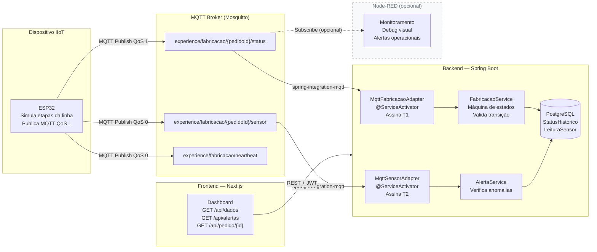
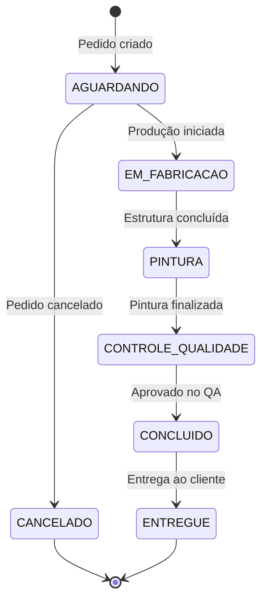
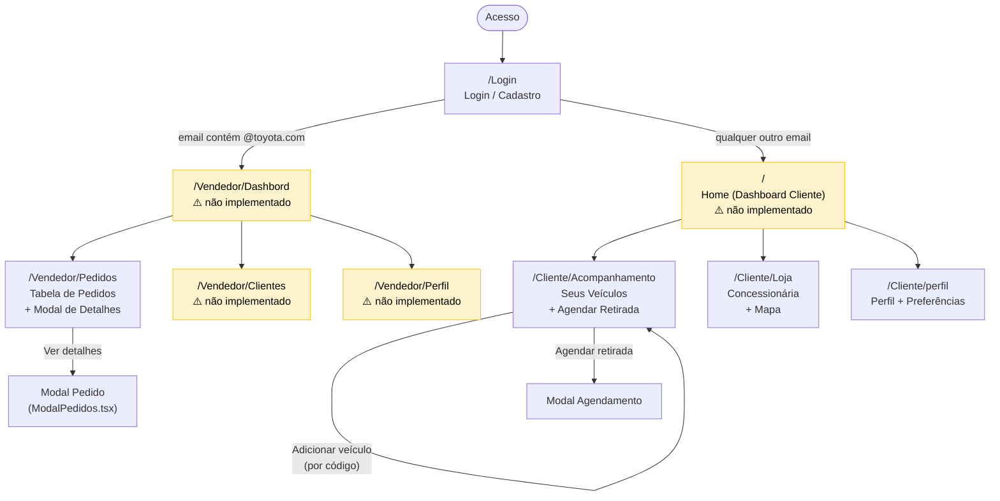
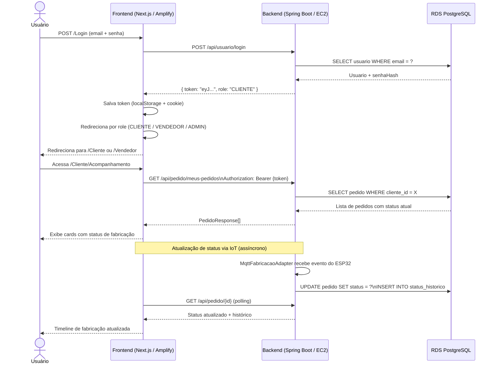
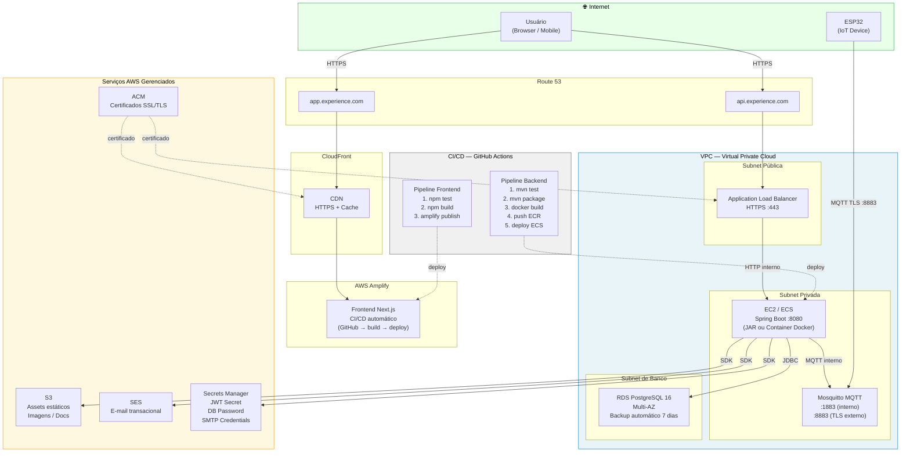
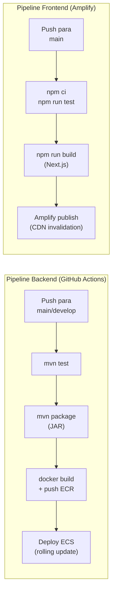

# Relatório de Arquitetura — Experience v3 (Monolito Hexagonal + Cloud AWS)

> Projeto: Sistema de Acompanhamento de Pedidos de Veículos — SENAI Experience  
> Versão analisada: v1 (Spring Boot MVC Tradicional)  
> Versão proposta: v3 (Monolito Hexagonal + Frontend Externo + Cloud AWS)  
> Data: 25/04/2026  

---

## 1. Diagnóstico da Versão Atual (v1)

### 1.1 Stack Identificada

| Componente        | Tecnologia                          |
|-------------------|-------------------------------------|
| Framework         | Spring Boot 3.3.1                   |
| Linguagem         | Java 17                             |
| Persistência      | Spring Data JPA + Hibernate         |
| Banco             | PostgreSQL                          |
| Segurança         | Spring Security + JWT (jjwt 0.11.5 + auth0 4.5.0) |
| Validação         | Jakarta Validation + Hibernate Validator |
| E-mail            | Spring Mail (SMTP Gmail)            |
| Build             | Maven                               |
| Utilitários       | Lombok 1.18.30                      |

### 1.2 Estrutura de Pacotes Atual

```
com.senai.experience
├── controllers/        ← Camada HTTP (REST)
├── services/           ← Lógica de negócio
├── repositories/       ← Acesso a dados (Spring Data JPA)
├── entities/           ← Modelos JPA
├── DTO/                ← Apenas LoginRequest
└── security/           ← JWT + Spring Security
```

### 1.3 Entidades Mapeadas

| Entidade        | Tabela           | Observações                                              |
|-----------------|------------------|----------------------------------------------------------|
| `Usuario`       | `usuario`        | Superclasse com herança JOINED. Possui autenticação JWT. |
| `PessoaFisica`  | `pessoa_fisica`  | Herda de Usuario. Valida CPF (Hibernate Validator).      |
| `PessoaJuridica`| `pessoa_juridica`| Herda de Usuario. Valida CNPJ + Razão Social.            |
| `Pedido`        | `tb_pedido`      | Contém idCliente e idVendedor como `int` primitivo.      |
| `Endereco`      | `tb_endereco`    | Entidade independente, sem FK para Usuario.              |
| `Telefone`      | `tb_telefone`    | Entidade independente, sem FK para Usuario.              |

### 1.4 Endpoints Disponíveis

| Método | Rota                    | Descrição                        |
|--------|-------------------------|----------------------------------|
| GET    | /api/pedido             | Listar todos os pedidos          |
| GET    | /api/pedido/{id}        | Buscar pedido por ID             |
| GET    | /api/usuario            | Listar usuários                  |
| POST   | /api/usuario/login      | Autenticação (retorna JWT)       |
| GET    | /api/usuario/me         | Dados do usuário autenticado     |
| CRUD   | /api/pessoaFisica       | CRUD Pessoa Física               |
| CRUD   | /api/pessoaJuridica     | CRUD Pessoa Jurídica             |
| CRUD   | /api/endereco           | CRUD Endereço                    |
| CRUD   | /api/telefones          | CRUD Telefone                    |

---

## 2. Arquitetura Atual com Cloud AWS e MQTT/IoT

> Este diagrama representa a arquitetura atual do código (MVC Spring Boot), com a camada de Cloud AWS e a integração MQTT/IoT inseridas como estão planejadas — sem refatoração hexagonal.

```mermaid
graph TB

    subgraph IOT["🔧 Dispositivo IoT"]
        ESP32["ESP32\nSimulador Linha de Produção\nPublica status via MQTT QoS 1\nPublica sensores via MQTT QoS 0"]
    end

    subgraph BROKER["📡 MQTT Broker — Mosquitto\n(AWS EC2 — porta 1883 interna / 8883 TLS externa)"]
        T1["experience/fabricacao/{pedidoId}/status"]
        T2["experience/fabricacao/{pedidoId}/sensor"]
        T3["experience/fabricacao/heartbeat"]
    end

    subgraph REPO_FRONTEND["📦 Repositório Externo — Frontend"]
        subgraph AMPLIFY["AWS Amplify + CloudFront"]
            UI_LOGIN["Login\nPOST /api/usuario/login"]
            UI_ACOMP["Acompanhamento\nGET /api/pedido/meus-pedidos\nGET /api/veiculo/{id}/status"]
            UI_PEDIDOS["Pedidos Vendedor\nGET /api/pedido"]
            UI_ADMIN["Administração\nGET /api/usuario\nPATCH /api/usuario/{id}/ativar"]
            UI_PERFIL["Perfil\nGET /api/usuario/me\nPUT /api/usuario/{id}"]
        end
    end

    subgraph AWS["☁️ AWS"]

        subgraph EC2["EC2 — Backend Spring Boot MVC :8080"]

            subgraph CONTROLLERS["controllers/"]
                C1["UsuarioController\n/api/usuario"]
                C2["PedidoController\n/api/pedido"]
                C3["VeiculoController\n/api/veiculo"]
                C4["StatusHistoricoController\n/api/veiculo/{id}/status"]
                C5["outros controllers"]
            end

            subgraph MQTT_ADAPTER["MQTT — spring-integration-mqtt\n(a implementar)"]
                MA1["MqttFabricacaoAdapter\n@ServiceActivator\nassina T1"]
                MA2["MqttSensorAdapter\n@ServiceActivator\nassina T2"]
            end

            subgraph SERVICES["services/"]
                S1["UsuarioService\n(BCrypt, login)"]
                S2["PedidoService\n(findMeusPedidos por role)"]
                S3["VeiculoService"]
                S4["StatusHistoricoService\n(máquina de estados ✅)"]
                S5["outros services"]
            end

            subgraph REPOSITORIES["repositories/ — Spring Data JPA"]
                R1["UsuarioRepository"]
                R2["PedidoRepository"]
                R3["VeiculoRepository"]
                R4["StatusHistoricoRepository"]
                R5["outros repositories"]
            end

            subgraph ENTITIES["entities/ — @Entity"]
                E1["Usuario / PessoaFisica / PessoaJuridica"]
                E2["Pedido (@ManyToOne cliente/vendedor)"]
                E3["Veiculo (@ManyToOne produto)\nStatusFabricacao enum"]
                E4["StatusHistorico (@ManyToOne veiculo)"]
                E5["Produto / Endereco / Telefone / ItemPedido"]
            end

            subgraph DTO_MAP["DTO/ + mappers/"]
                D1["request/ + response/\nmappers manuais"]
            end

            subgraph SECURITY["security/"]
                SEC["JwtUtil + JwtAuthFilter\nSecurityConfig\nCorsConfig ← a adicionar"]
            end

        end

        subgraph RDS["AWS RDS — PostgreSQL 16"]
            DB[("db_experience\nMulti-AZ\nBackup automático")]
        end

        subgraph SM["AWS Secrets Manager"]
            ENV["JWT_SECRET\nDB_PASSWORD\nSMTP_CREDENTIALS"]
        end

        subgraph SES["AWS SES"]
            EMAIL["E-mail transacional"]
        end

        subgraph ALB["Application Load Balancer\nHTTPS :443 + ACM"]
        end

        subgraph CICD["GitHub Actions CI/CD"]
            GHA_BE["build → test → deploy EC2"]
            GHA_FE["build → deploy Amplify"]
        end

    end

    %% IoT → Broker → Backend
    ESP32 -->|"MQTT Publish QoS 1"| T1
    ESP32 -->|"MQTT Publish QoS 0"| T2
    ESP32 -->|"MQTT Publish QoS 0"| T3
    T1 -->|"spring-integration-mqtt"| MA1
    T2 -->|"spring-integration-mqtt"| MA2

    %% Frontend → Backend (HTTPS via ALB)
    UI_LOGIN & UI_ACOMP & UI_PEDIDOS & UI_ADMIN & UI_PERFIL -->|"HTTPS + JWT"| ALB --> EC2

    %% MQTT Adapters → Services
    MA1 --> S4
    MA2 --> S5

    %% Controllers → Services → Repositories → Entities → RDS
    C1 --> S1 --> R1
    C2 --> S2 --> R2
    C3 --> S3 --> R3
    C4 --> S4 --> R4
    C5 --> S5 --> R5
    R1 & R2 & R3 & R4 & R5 -->|"JPA/Hibernate"| E1 & E2 & E3 & E4 & E5
    E1 & E2 & E3 & E4 & E5 -->|"@Entity → tabelas"| DB

    %% Infraestrutura transversal
    SEC -.->|"JWT filter + CORS"| C1 & C2 & C3 & C4
    D1 -.->|"request/response"| C1 & C2 & C3 & C4
    ENV -.->|"injetado em runtime"| EC2
    EC2 -->|"SDK"| SES

    %% CI/CD
    GHA_BE -.->|"deploy"| EC2
    GHA_FE -.->|"deploy"| AMPLIFY

    style IOT fill:#d4edda,stroke:#28a745,color:#000
    style BROKER fill:#cce5ff,stroke:#004085,color:#000
    style REPO_FRONTEND fill:#e8f4f8,stroke:#0077b6,color:#000
    style AWS fill:#fff8e1,stroke:#ff9900,color:#000
    style EC2 fill:#ffe8cc,stroke:#ff9900,color:#000
    style RDS fill:#ffe8cc,stroke:#ff9900,color:#000
    style SM fill:#ffe8cc,stroke:#ff9900,color:#000
    style SES fill:#ffe8cc,stroke:#ff9900,color:#000
    style ALB fill:#ffe8cc,stroke:#ff9900,color:#000
    style AMPLIFY fill:#ffe8cc,stroke:#ff9900,color:#000
    style CICD fill:#ffe8cc,stroke:#ff9900,color:#000
    style MQTT_ADAPTER fill:#d4edda,stroke:#28a745,color:#000,stroke-dasharray: 5 5
```



> Itens com borda tracejada (MQTT Adapters, CorsConfig) ainda não estão implementados — são os próximos passos imediatos antes da integração frontend-backend.

### 2.1 O que já está bem na v1

| Aspecto | Situação |
|---|---|
| DTOs de request e response | ✅ Já separados das entidades |
| Mappers manuais | ✅ Já existem para todos os domínios |
| Máquina de estados de fabricação | ✅ `StatusHistoricoService` com validação de transições |
| Autenticação JWT + BCrypt | ✅ Funcionando |
| Roles por endpoint no SecurityConfig | ✅ Configurado |
| Relacionamentos JPA reais | ✅ `@ManyToOne` em Pedido, Veiculo, StatusHistorico |

### 2.2 O que precisa evoluir para a v3

| Aspecto | Situação |
|---|---|
| CORS | ❌ Não configurado |
| Frontend integrado à API | ❌ Dados mockados |
| MQTT / IoT | ❌ Não implementado |
| Cloud AWS | ❌ Roda apenas local |
| Frontend em repositório separado | ❌ Mesmo repositório |
| Arquitetura Hexagonal | ❌ MVC tradicional |
| Endpoints ativar/desativar usuário | ❌ Não existem |
| PedidoResponse enriquecido | ❌ Não retorna clienteNome/veiculoModelo |

---

## 3. Problemas Identificados na v1

### 3.1 Críticos

- **Credenciais expostas no código-fonte**: `application.properties` contém senha de e-mail Gmail em texto puro e chave JWT hardcoded. Risco de segurança grave em repositório versionado.
- **Banco PostgreSQL configurado**: Banco de produção único, sem H2.
- **Dois providers JWT simultâneos**: `jjwt` (0.11.5) e `auth0 java-jwt` (4.5.0) coexistem no `pom.xml`. Apenas o `jjwt` é utilizado. Dependência morta e risco de conflito.
- **`JwtUtil` com estado estático**: A chave JWT é armazenada em campo `static`, o que quebra o contrato de injeção de dependência do Spring e dificulta testes.

### 3.2 Arquiteturais

- **Entidades JPA expostas diretamente nas APIs**: Controllers recebem e retornam `@Entity` diretamente. Qualquer mudança no modelo de banco impacta o contrato da API.
- **Ausência de relacionamentos JPA**: `Pedido` referencia `idCliente` e `idVendedor` como `int` primitivo, sem `@ManyToOne`. `Endereco` e `Telefone` não possuem FK para `Usuario`.
- **Herança `JOINED` sem discriminação de papel**: `Usuario` não possui campo de role/perfil além do hardcoded `"USER"` no `CustomUserDetailsService`. Impossível diferenciar cliente de vendedor.
- **`SecurityConfig` libera tudo**: `.requestMatchers("/**").permitAll()` torna o JWT ineficaz para proteção de rotas.
- **Services sem tratamento de exceção**: Todos os services retornam `null` quando o recurso não é encontrado, em vez de lançar exceções tipadas.
- **Mistura de estilos de injeção**: Alguns controllers usam `@Autowired` (field injection), outros usam construtor. Inconsistência que dificulta testes unitários.
- **Ausência de DTOs de resposta**: Apenas `LoginRequest` existe como DTO. Todos os demais endpoints expõem a entidade completa, incluindo `senhaHash`.
- **Sem paginação**: Todos os `findAll()` retornam listas completas sem paginação, inviável em produção.
- **Sem tratamento global de erros**: Nenhum `@ControllerAdvice` / `@ExceptionHandler` global.
- **Sem camada de domínio real**: A lógica de negócio está nos services, mas eles operam diretamente sobre entidades JPA, sem objetos de domínio ricos.

### 3.3 Funcionais (para o contexto do produto)

- **Sem foco em acompanhamento**: A entidade `Pedido` não possui campos de status de fabricação nem histórico de transições. O sistema atual não serve ao propósito principal de permitir que o cliente visualize o andamento da fabricação e entrega do veículo.
- **Sem módulo de Dashboard**: Nenhuma entidade ou endpoint para notícias/conteúdo da marca exibido no painel do cliente.
- **Sem auditoria**: Nenhum campo de `createdAt` / `updatedAt` / `createdBy` nas entidades.
- **Sem separação de frontend**: Não há definição de onde o frontend reside, como consome a API ou como é servido.

---

## 4. Arquitetura Proposta — v3 (Monolito Hexagonal + Cloud AWS)

### 4.1 Conceito

A Arquitetura Hexagonal (Ports & Adapters) isola o núcleo de domínio de qualquer detalhe de infraestrutura. O domínio não conhece Spring, JPA, HTTP ou banco de dados. Ele expõe **portas** (interfaces) e a infraestrutura fornece **adaptadores** (implementações).

A partir da v3, o sistema é composto por **cinco camadas externas distintas**:

- **Dispositivo IoT** (ESP32): simula a linha de produção e publica eventos de status via MQTT no broker.
- **Broker MQTT** (Mosquitto): recebe e distribui as mensagens. Ponto central de comunicação assíncrona.
- **Backend** (este repositório — monolito hexagonal): **assina diretamente o broker MQTT** via `spring-integration-mqtt`. Processa os eventos, aplica regras de negócio, persiste e expõe via REST. Hospedado na **AWS**.
- **Frontend** (repositório separado — SPA Next.js): consome a API REST via HTTP/JWT. Hospedado na **AWS Amplify**. Integrado ao backend exclusivamente via API pública com CORS configurado.
- **Cloud AWS**: infraestrutura de hospedagem, banco gerenciado, armazenamento e CI/CD.

> O frontend reside em um repositório Git independente e se comunica com o backend apenas via chamadas HTTP REST autenticadas com JWT. Não há acoplamento de código entre os dois repositórios.

> O Node-RED é uma ferramenta auxiliar opcional para monitoramento e debug do fluxo MQTT, mas **não é um componente obrigatório** do pipeline.

```mermaid
graph TB

    subgraph IOT["🔧 DISPOSITIVO IoT"]
        ESP32["ESP32\nSimulador Linha de Produção\nPublica status MQTT QoS 1\nPublica sensores MQTT QoS 0"]
    end

    subgraph NODERED_OPT["🔍 Node-RED (opcional — monitoramento)"]
        NR["Assina tópicos\nVisualiza fluxo / Debug"]
    end

    subgraph REPO_FRONTEND["📦 Repositório Externo — Frontend"]
        subgraph AMPLIFY_FE["AWS Amplify + CloudFront CDN"]
            UI_LOGIN["Login\nPOST /api/usuario/login"]
            UI_ACOMP["Acompanhamento\nGET /api/pedido/meus-pedidos\nGET /api/veiculo/{id}/status"]
            UI_PEDIDOS["Pedidos Vendedor\nGET /api/pedido"]
            UI_ADMIN["Administração\nGET /api/usuario\nPATCH /api/usuario/{id}/ativar"]
            UI_DASH["Dashboard\nGET /api/dashboard\nGET /api/dados\nGET /api/alertas"]
        end
    end

    subgraph AWS["☁️ AWS — Cloud"]

        subgraph BROKER_AWS["📡 EC2 — MQTT Broker (Mosquitto)\nporta 1883 interna / 8883 TLS externa"]
            T1["experience/fabricacao/{pedidoId}/status\nQoS 1 — retain"]
            T2["experience/fabricacao/{pedidoId}/sensor\nQoS 0"]
            T3["experience/fabricacao/heartbeat\nQoS 0"]
        end

        subgraph EC2_ECS["EC2 / ECS — Backend Spring Boot"]

            subgraph ENTRADA["Adaptadores de Entrada"]
                MQTT_IN["MqttFabricacaoAdapter\n@ServiceActivator\nspring-integration-mqtt\nassina T1"]
                MQTT_SEN["MqttSensorAdapter\n@ServiceActivator\nassina T2"]
                REST_AUTH["UsuarioController\nPOST /api/usuario/login\nGET /api/usuario/me"]
                REST_CLI["AcompanhamentoController\nDashboardController"]
                REST_DADOS["DadosController\nGET /api/dados\nGET /api/alertas"]
            end

            subgraph CORE["⬡ Núcleo Hexagonal — Domínio Puro"]

                subgraph PORTS_IN["Portas de Entrada (Use Cases)"]
                    FUC["FabricacaoUseCase\n(máquina de estados)"]
                    PUC["AcompanhamentoPedidoUseCase"]
                    DUC["DashboardUseCase"]
                    AUC["AlertaUseCase"]
                    CUC["ClienteUseCase"]
                end

                subgraph DOMAIN["Modelos de Domínio"]
                    PED["Pedido"]
                    VEI["Veiculo"]
                    STA["StatusFabricacao\nAGUARDANDO → EM_FABRICACAO\n→ PINTURA → CONTROLE_QUALIDADE\n→ CONCLUIDO → ENTREGUE"]
                    HIS["StatusHistorico"]
                    SEN["LeituraSensor"]
                    CLI["Cliente"]
                    NOT["Noticia"]
                end

                subgraph PORTS_OUT["Portas de Saída (Interfaces)"]
                    PRP["PedidoRepositoryPort"]
                    VRP["VeiculoRepositoryPort"]
                    FRP["FabricacaoRepositoryPort"]
                    SRP["SensorRepositoryPort"]
                    CRP["ClienteRepositoryPort"]
                    NRP["NoticiaRepositoryPort"]
                    MLP["MailPort"]
                end

            end

            subgraph SAIDA["Adaptadores de Saída"]
                JPA["JPA Adapters\n(implementam as portas)"]
                SMTP_ADP["SES Adapter\n(implementa MailPort)"]
            end

            subgraph INFRA_T["Infraestrutura Transversal"]
                SEC["Spring Security + JWT\nCorsConfig"]
                APP["DTOs + Mappers\napplication/"]
                MQTTCFG["MqttConfig\nConnectionFactory\nMessageChannel"]
            end

        end

        subgraph RDS["AWS RDS — PostgreSQL 16\nMulti-AZ / Backup automático"]
            DB[("db_experience")]
        end

        subgraph S3["AWS S3"]
            ASSETS["Assets estáticos\nImagens / Documentos"]
        end

        subgraph SM["AWS Secrets Manager"]
            ENV["JWT_SECRET\nDB_PASSWORD\nSMTP_CREDENTIALS\nMQTT_PASSWORD"]
        end

        subgraph SES["AWS SES"]
            EMAIL["E-mail transacional"]
        end

        subgraph ALB["Application Load Balancer\nHTTPS :443 + ACM"]
        end

        subgraph CICD["CI/CD — GitHub Actions"]
            GHA_BE["Pipeline Backend\nbuild → test → docker → ECR → ECS"]
            GHA_FE["Pipeline Frontend\nbuild → amplify publish"]
        end

    end

    %% IoT → Broker
    ESP32 -->|"MQTT Publish QoS 1\nTLS :8883"| T1
    ESP32 -->|"MQTT Publish QoS 0\nTLS :8883"| T2
    ESP32 -->|"MQTT Publish QoS 0"| T3
    T1 -.->|"Subscribe (opcional)"| NR

    %% Broker → Backend
    T1 -->|"spring-integration-mqtt"| MQTT_IN
    T2 -->|"spring-integration-mqtt"| MQTT_SEN

    %% Frontend → ALB → Backend
    UI_LOGIN & UI_ACOMP & UI_PEDIDOS & UI_ADMIN & UI_DASH -->|"HTTPS + JWT"| ALB
    ALB --> REST_AUTH & REST_CLI & REST_DADOS

    %% Adaptadores de entrada → Use Cases
    MQTT_IN --> FUC
    MQTT_SEN --> AUC
    REST_CLI --> PUC & DUC
    REST_DADOS --> AUC
    REST_AUTH --> CUC

    %% Use Cases → Domínio
    FUC --> STA & HIS & VEI
    PUC --> PED & VEI & HIS
    DUC --> NOT & PED
    AUC --> SEN & HIS
    CUC --> CLI

    %% Domínio → Portas de Saída
    PRP & VRP & FRP & SRP & CRP & NRP --> JPA
    MLP --> SMTP_ADP

    %% Adaptadores de Saída → AWS
    JPA -->|"JPA/Hibernate"| DB
    SMTP_ADP --> EMAIL
    ASSETS -.->|"referenciado por"| NOT

    %% Infraestrutura transversal
    MQTTCFG -.->|"configura"| MQTT_IN & MQTT_SEN
    SEC -.->|"JWT filter + CORS"| REST_AUTH & REST_CLI & REST_DADOS
    APP -.->|"request/response"| REST_AUTH & REST_CLI & REST_DADOS
    ENV -.->|"injetado em runtime"| EC2_ECS

    %% CI/CD
    GHA_BE -.->|"deploy"| EC2_ECS
    GHA_FE -.->|"deploy"| AMPLIFY_FE

    style IOT fill:#d4edda,stroke:#28a745,color:#000
    style NODERED_OPT fill:#f8f9fa,stroke:#adb5bd,color:#6c757d,stroke-dasharray: 5 5
    style REPO_FRONTEND fill:#e8f4f8,stroke:#0077b6,color:#000
    style AWS fill:#fff8e1,stroke:#ff9900,color:#000
    style BROKER_AWS fill:#cce5ff,stroke:#004085,color:#000
    style EC2_ECS fill:#ffe8cc,stroke:#ff9900,color:#000
    style CORE fill:#f3e5f5,stroke:#7b1fa2,color:#000
    style DOMAIN fill:#ede7f6,stroke:#7b1fa2,color:#000
    style RDS fill:#ffe8cc,stroke:#ff9900,color:#000
    style S3 fill:#ffe8cc,stroke:#ff9900,color:#000
    style SM fill:#ffe8cc,stroke:#ff9900,color:#000
    style SES fill:#ffe8cc,stroke:#ff9900,color:#000
    style ALB fill:#ffe8cc,stroke:#ff9900,color:#000
    style AMPLIFY_FE fill:#ffe8cc,stroke:#ff9900,color:#000
    style CICD fill:#ffe8cc,stroke:#ff9900,color:#000
```



### 4.2 Estrutura de Pacotes Proposta

```
com.senai.experience
│
├── domain/                          ← NÚCLEO — zero dependência de framework
│   ├── model/
│   │   ├── Pedido.java
│   │   ├── Veiculo.java
│   │   ├── Cliente.java
│   │   ├── Vendedor.java
│   │   ├── Noticia.java
│   │   ├── LeituraSensor.java       ← Dado bruto do ESP32 (deviceId, valor, timestamp)
│   │   ├── StatusFabricacao.java    ← Enum: AGUARDANDO, EM_FABRICACAO, PINTURA, QUALIDADE, CONCLUIDO, ENTREGUE
│   │   └── StatusHistorico.java
│   │
│   ├── port/
│   │   ├── in/
│   │   │   ├── AcompanhamentoPedidoUseCase.java  ← consulta status e histórico
│   │   │   ├── FabricacaoUseCase.java   ← chamado pelo MqttFabricacaoAdapter
│   │   │   ├── ClienteUseCase.java
│   │   │   ├── DashboardUseCase.java
│   │   │   └── AlertaUseCase.java       ← GET /api/alertas
│   │   └── out/
│   │       ├── PedidoRepositoryPort.java
│   │       ├── ClienteRepositoryPort.java
│   │       ├── VeiculoRepositoryPort.java
│   │       ├── FabricacaoRepositoryPort.java
│   │       ├── SensorRepositoryPort.java    ← persiste leituras brutas
│   │       ├── NoticiaRepositoryPort.java
│   │       └── MailPort.java
│   │
│   └── service/
│       ├── PedidoService.java
│       ├── FabricacaoService.java
│       ├── ClienteService.java
│       ├── DashboardService.java
│       └── AlertaService.java
│
├── application/
│   ├── dto/
│   │   ├── request/
│   │   │   └── LoginRequest.java
│   │   └── response/
│   │       ├── PedidoResponse.java
│   │       ├── StatusFabricacaoResponse.java
│   │       ├── ClienteResponse.java
│   │       ├── DashboardResponse.java
│   │       ├── LeituraSensorResponse.java   ← GET /api/dados
│   │       └── NoticiaResponse.java
│   └── mapper/
│       ├── PedidoMapper.java
│       ├── ClienteMapper.java
│       └── SensorMapper.java
│
├── infrastructure/
│   ├── mqtt/                            ← NOVO — integração MQTT
│   │   ├── MqttConfig.java              ← ConnectionFactory, MessageChannel, QoS, broker URL
│   │   ├── MqttFabricacaoAdapter.java   ← @ServiceActivator — assina tópico de status
│   │   └── MqttSensorAdapter.java       ← @ServiceActivator — assina tópico de sensores
│   │
│   ├── persistence/
│   │   ├── entity/
│   │   │   ├── PedidoEntity.java
│   │   │   ├── VeiculoEntity.java
│   │   │   ├── ClienteEntity.java
│   │   │   ├── StatusHistoricoEntity.java
│   │   │   ├── LeituraSensorEntity.java
│   │   │   └── NoticiaEntity.java
│   │   ├── repository/
│   │   │   ├── PedidoJpaRepository.java
│   │   │   ├── ClienteJpaRepository.java
│   │   │   ├── FabricacaoJpaRepository.java
│   │   │   ├── SensorJpaRepository.java
│   │   │   └── NoticiaJpaRepository.java
│   │   └── adapter/
│   │       ├── PedidoRepositoryAdapter.java
│   │       ├── ClienteRepositoryAdapter.java
│   │       ├── FabricacaoRepositoryAdapter.java
│   │       ├── SensorRepositoryAdapter.java
│   │       └── NoticiaRepositoryAdapter.java
│   │
│   ├── mail/
│   │   └── SmtpMailAdapter.java
│   │
│   └── security/
│       ├── JwtUtil.java
│       ├── JwtAuthFilter.java
│       ├── SecurityConfig.java
│       └── CustomUserDetailsService.java
│
└── adapter/
    └── rest/
        ├── AcompanhamentoController.java  ← GET /api/pedido, GET /api/pedido/{id}
        ├── DashboardController.java
        ├── DadosController.java         ← GET /api/dados, GET /api/alertas
        └── UsuarioController.java
```

### 4.3 Módulos Funcionais da v3

#### Módulo 1 — Acompanhamento de Pedidos
Responsável pela consulta e visualização do status dos pedidos de veículos. Os pedidos são criados externamente (ex: concessionária, sistema legado) e registrados no sistema para acompanhamento.

- Consultar pedido por ID ou por cliente
- Listar pedidos com filtros e paginação
- Visualizar histórico de status de fabricação e entrega

#### Módulo 2 — Fabricação (MQTT direto no backend)

O backend assina o broker MQTT diretamente via `spring-integration-mqtt`. Não há intermediário HTTP obrigatório — o evento sai do ESP32, passa pelo broker e chega ao `MqttFabricacaoAdapter` dentro do Spring Boot.

**Fluxo completo:**



**Definições da Camada MQTT (4.2):**

| Item | Definição |
|------|-----------|
| Broker | Mosquitto (local, porta 1883) |
| QoS status | 1 — at least once (garante entrega da mudança de etapa) |
| QoS sensor | 0 — at most once (leituras contínuas, perda aceitável) |
| QoS heartbeat | 0 — sinal de vida periódico |
| Retenção | `retain=true` no tópico de status (último estado sempre disponível) |
| Autenticação broker | usuário/senha configurados no `mosquitto.conf` |

**Estrutura de tópicos MQTT (4.1):**
```
experience/fabricacao/{pedidoId}/status    ← mudança de etapa (QoS 1, retain)
experience/fabricacao/{pedidoId}/sensor    ← leitura de sensor (QoS 0)
experience/fabricacao/heartbeat            ← sinal de vida do ESP32 (QoS 0)
```

**Payload MQTT — status (ESP32 → Broker → Backend):**
```json
{
  "deviceId": "ESP32-linha-01",
  "pedidoId": 4821,
  "etapa": "PINTURA",
  "timestamp": "2026-03-27T14:30:00Z"
}
```

**Payload MQTT — sensor (ESP32 → Broker → Backend):**
```json
{
  "deviceId": "ESP32-linha-01",
  "pedidoId": 4821,
  "temperatura": 78.5,
  "vibracao": 1.2,
  "timestamp": "2026-03-27T14:30:05Z"
}
```

**Dependência a adicionar no `pom.xml`:**
```xml
<!-- MQTT via Spring Integration -->
<dependency>
    <groupId>org.springframework.integration</groupId>
    <artifactId>spring-integration-mqtt</artifactId>
</dependency>
<dependency>
    <groupId>org.springframework.boot</groupId>
    <artifactId>spring-boot-starter-integration</artifactId>
</dependency>
```

**Configuração mínima (`application.properties`):**
```properties
mqtt.broker.url=tcp://localhost:1883
mqtt.broker.username=experience
mqtt.broker.password=senha_mqtt
mqtt.client.id=backend-experience
mqtt.topic.status=experience/fabricacao/+/status
mqtt.topic.sensor=experience/fabricacao/+/sensor
```

**Endpoints REST expostos (4.3):**

| Método | Rota | Descrição |
|--------|------|-----------|
| GET | /api/dados | Lista leituras de sensores (paginado) |
| GET | /api/dados/{pedidoId} | Leituras de um pedido específico |
| GET | /api/alertas | Lista alertas gerados por anomalias |
| GET | /api/fabricacao/{pedidoId}/historico | Histórico de transições de status |

**Máquina de estados da fabricação:**



#### Módulo 3 — Clientes
Gestão de clientes PF e PJ com seus dados de contato.

- Cadastro com validação de CPF/CNPJ
- Associação de endereços e telefones ao cliente (FK real)
- Perfis: CLIENTE, VENDEDOR, ADMIN

#### Módulo 4 — Dashboard
Agrega dados para o painel do cliente no frontend. Não possui domínio próprio — é um use case de leitura que compõe dados de outros módulos.

- Retorna status atual de fabricação do pedido do cliente autenticado
- Retorna lista de notícias da marca (conteúdo editorial simples)
- Endpoint único: `GET /api/dashboard` — resposta agregada com status do pedido + notícias
- Notícias: CRUD admin via `POST/PUT/DELETE /api/noticias`, listagem pública paginada

> O sistema não permite que o cliente crie ou altere pedidos. O papel do cliente é exclusivamente visualizar o andamento da fabricação e entrega do veículo já adquirido.

#### Módulo 5 — Autenticação
- Login com JWT
- Roles: `ROLE_CLIENTE`, `ROLE_VENDEDOR`, `ROLE_ADMIN`
- Refresh token
- Proteção de rotas por role

---

## 5. Frontend — Repositório Externo e Integração

> A partir da v3, o frontend reside em um **repositório Git separado** do backend. Os dois projetos se comunicam exclusivamente via API REST pública com autenticação JWT. Não há dependência de código entre os repositórios.

### 4.1 Stack do Frontend

| Item | Tecnologia |
|------|-----------|
| Framework | Next.js 14 (App Router) |
| Linguagem | TypeScript |
| Estilo | Tailwind CSS |
| Ícones | Lucide React |
| Roteamento | Next.js file-based routing |
| Auth | JWT armazenado em `localStorage` + cookie para middleware |
| Hospedagem | AWS Amplify |
| CI/CD | GitHub Actions → deploy automático no Amplify |

### 4.2 Separação de Repositórios

| Repositório | Conteúdo | Deploy |
|---|---|---|
| `Experience` (este) | Backend Spring Boot + documentação | AWS EC2 / ECS via GitHub Actions |
| `Experience-Frontend` (externo) | SPA Next.js | AWS Amplify (CI/CD automático) |

**Contrato de integração:**
- O frontend consome a API do backend via `NEXT_PUBLIC_API_URL` (variável de ambiente configurada no Amplify)
- Toda comunicação é HTTPS
- Autenticação via `Authorization: Bearer {token}` em todas as rotas protegidas
- O backend configura CORS para aceitar requisições do domínio do Amplify

### 4.3 Telas Existentes

| Tela | Rota | Perfil | Status |
|------|------|--------|--------|
| Login / Cadastro | `/Login` | Público | Implementado (mock — sem chamada real à API) |
| Acompanhamento de Veículos | `/Cliente/Acompanhamento` | Cliente | Implementado (dados hardcoded) |
| Concessionária (Loja) | `/Cliente/Loja` | Cliente | Implementado (endereço fixo hardcoded) |
| Perfil do Cliente | `/Cliente/perfil` | Cliente | Implementado (lê email do localStorage) |
| Pedidos do Vendedor | `/Vendedor/Pedidos` | Vendedor | Implementado (dados hardcoded) |
| Dashboard (home) | `/` | Cliente | Referenciado na Sidebar, não mapeado |
| Dashboard Vendedor | `/Vendedor/Dashbord` | Vendedor | Referenciado no nav, não mapeado |
| Clientes do Vendedor | `/Vendedor/Clientes` | Vendedor | Referenciado no nav, não mapeado |
| Perfil do Vendedor | `/Vendedor/Perfil` | Vendedor | Referenciado no nav, não mapeado |

### 4.4 Componentes Compartilhados

| Componente | Uso |
|-----------|-----|
| `SideBar.tsx` | Navegação do cliente (mobile bottom bar + desktop icon bar) |
| `ModalPedidos.tsx` | Modal de detalhes de pedido (cliente) |
| `Card.tsx` | Componente genérico de card |
| Sidebar inline em `Vendedor/Pedidos` | Sidebar do vendedor embutida diretamente na página (não reutilizável) |

### 4.5 Diagrama de Navegação



### 4.6 Problemas Identificados no Frontend

**Críticos**
- Autenticação completamente simulada — o login não chama `/api/usuario/login`, apenas salva o email no `localStorage`. Qualquer email/senha funciona.
- Roteamento de perfil baseado em `email.includes("@toyota.com")` — frágil e inseguro. O papel do usuário deve vir do JWT retornado pelo backend.
- Dados de pedidos, clientes e status hardcoded em todos os componentes — nenhuma tela consome a API real.

**Arquiteturais**
- Sem camada de serviço/cliente HTTP centralizado — cada tela deveria ter um `service` ou `api client` para isolar as chamadas ao backend.
- Sidebar do vendedor duplicada inline em `Vendedor/Pedidos` em vez de usar um componente reutilizável.
- Sem gerenciamento de estado global (sem Context API, Zustand ou similar) — estado de autenticação espalhado via `localStorage`.
- Sem variável de ambiente para a URL base da API (`NEXT_PUBLIC_API_URL`).

**Funcionais**
- Tela de acompanhamento adiciona veículo por "código" mas não define o que é esse código nem como ele se relaciona com o `id` do pedido no backend.
- Agendamento de retirada exibe `alert()` — não persiste nada.
- Perfil do cliente exibe nome fixo "Lauren" — não busca dados reais do usuário autenticado.
- Telas `/Vendedor/Dashbord`, `/Vendedor/Clientes` e `/Vendedor/Perfil` são referenciadas na navegação mas não existem.

### 4.7 Integração Frontend ↔ Backend na v3



### 4.8 Estrutura de Pastas Sugerida para o Frontend (v3)

```
experience-frontend/          ← repositório separado
├── app/
│   ├── (auth)/
│   │   └── login/page.tsx
│   ├── cliente/
│   │   ├── acompanhamento/page.tsx
│   │   ├── loja/page.tsx
│   │   └── perfil/page.tsx
│   ├── vendedor/
│   │   ├── dashboard/page.tsx
│   │   ├── pedidos/page.tsx
│   │   ├── clientes/page.tsx
│   │   ├── perfil/page.tsx
│   │   └── administracao/page.tsx
│   └── layout.tsx
├── middleware.ts              ← proteção de rotas por role
├── lib/
│   ├── api.ts                 ← API Client centralizado (fetch + JWT)
│   ├── auth.ts                ← AuthService (localStorage + cookie)
│   └── types.ts               ← interfaces TypeScript espelhando DTOs do backend
├── components/
│   ├── Sidebar/
│   │   ├── SidebarCliente.tsx
│   │   └── SidebarVendedor.tsx
│   ├── Modal/
│   │   ├── ModalPedido.tsx
│   │   └── ModalAgendamento.tsx
│   └── Card.tsx
└── .env.local
    └── NEXT_PUBLIC_API_URL=https://api.experience.com
```

---

## 6. Infraestrutura Cloud — AWS

### 6.1 Visão Geral dos Serviços AWS

| Serviço AWS | Uso no Projeto | Justificativa |
|---|---|---|
| **EC2 / ECS** | Hospedagem do backend Spring Boot | Controle total sobre o runtime Java; ECS para containerização futura |
| **RDS (PostgreSQL)** | Banco de dados gerenciado | Backups automáticos, failover, sem gestão de servidor |
| **Amplify** | Hospedagem do frontend Next.js | CI/CD automático a partir do repositório Git, CDN global integrado |
| **CloudFront** | CDN para o frontend | Distribuição global, cache de assets estáticos, HTTPS automático |
| **S3** | Assets estáticos (imagens, documentos) | Armazenamento barato e durável para imagens de notícias e veículos |
| **Secrets Manager** | Credenciais e segredos | JWT secret, credenciais do banco, SMTP — nunca no código-fonte |
| **SES (Simple Email Service)** | Envio de e-mails transacionais | Substitui SMTP Gmail em produção |
| **Route 53** | DNS | Domínio customizado para API e frontend |
| **ACM (Certificate Manager)** | Certificados SSL/TLS | HTTPS automático para API e frontend |
| **GitHub Actions** | CI/CD | Pipeline de build, test e deploy para backend e frontend |

### 6.2 Diagrama de Infraestrutura AWS



### 6.3 Configuração de Variáveis de Ambiente

**Backend (EC2 / ECS — via Secrets Manager ou variáveis de ambiente):**
```properties
# Banco
SPRING_DATASOURCE_URL=jdbc:postgresql://{rds-endpoint}:5432/db_experience
SPRING_DATASOURCE_USERNAME={rds-user}
SPRING_DATASOURCE_PASSWORD={rds-password}

# JWT
JWT_SECRET={secret-do-secrets-manager}
JWT_EXPIRATION=86400000

# CORS — domínio do frontend no Amplify
CORS_ALLOWED_ORIGINS=https://app.experience.com

# E-mail (SES)
SPRING_MAIL_HOST=email-smtp.us-east-1.amazonaws.com
SPRING_MAIL_USERNAME={ses-smtp-user}
SPRING_MAIL_PASSWORD={ses-smtp-password}

# MQTT
MQTT_BROKER_URL=tcp://localhost:1883
```

**Frontend (Amplify — variáveis de ambiente do build):**
```env
NEXT_PUBLIC_API_URL=https://api.experience.com
```

### 6.4 Pipeline CI/CD



### 6.5 Segurança na AWS

| Aspecto | Implementação |
|---|---|
| Credenciais | AWS Secrets Manager — nunca no código ou `.properties` |
| Rede | Backend em subnet privada — acesso apenas via ALB |
| HTTPS | ACM + CloudFront (frontend) e ACM + ALB (backend) |
| MQTT TLS | Mosquitto com certificado TLS na porta 8883 para ESP32 externo |
| IAM | Roles mínimas por serviço (EC2 acessa S3 e SES via IAM Role, sem chaves hardcoded) |
| RDS | Sem acesso público — apenas EC2 na mesma VPC |
| CORS | Backend aceita apenas o domínio do Amplify em produção |

---

## 7. Novas Entidades Necessárias

### `Veiculo`
```java
// Campos sugeridos
Long id
String modelo
String marca
String cor
BigDecimal preco
String imagemUrl
boolean disponivel
```

### `Pedido` (expandido)
```java
// Pedido registrado externamente, acompanhado pelo cliente via app
Long id
Cliente cliente
Veiculo veiculo
StatusFabricacao status
LocalDateTime dataPedido
LocalDateTime dataEntregaPrevista
List<StatusHistorico> historico
```

### `StatusHistorico`
```java
Long id
Pedido pedido
StatusFabricacao statusAnterior
StatusFabricacao statusNovo
LocalDateTime alteradoEm
String alteradoPor
```

### `Noticia`
```java
Long id
String titulo
String resumo
String conteudo
String imagemUrl
LocalDateTime publicadoEm
boolean ativo
```

---

## 8. Plano de Migração v1 → v3

### Fase 1 — Fundação (sem quebrar a v1)
1. Criar estrutura de pacotes hexagonal
2. Criar objetos de domínio puros (sem anotações JPA)
3. Definir interfaces de porta (`in` e `out`)
4. Criar DTOs de request/response para todos os endpoints

### Fase 2 — Infraestrutura
5. Criar `@Entity` separadas dos objetos de domínio
6. Implementar adapters JPA que implementam as portas de saída
7. Criar mappers domínio ↔ entidade JPA ↔ DTO
8. Migrar `application.properties` para variáveis de ambiente (AWS Secrets Manager)
9. Confirmar PostgreSQL como banco principal (já configurado)

### Fase 3 — Domínio e Casos de Uso
10. Implementar `AcompanhamentoPedidoService` com consultas por cliente e histórico de status
11. Implementar `FabricacaoService` com máquina de estados (atualizado via MQTT, não pelo cliente)
12. Adicionar entidades `Veiculo`, `StatusHistorico`, `Noticia`
13. Corrigir relacionamentos JPA (FKs reais)

### Fase 4 — Integração MQTT
14. Adicionar dependências `spring-integration-mqtt` e `spring-boot-starter-integration`
15. Criar `MqttConfig.java` com `ConnectionFactory`, `MessageChannel` e assinatura dos tópicos
16. Implementar `MqttFabricacaoAdapter` com `@ServiceActivator` que chama `FabricacaoUseCase`
17. Implementar `MqttSensorAdapter` para leituras brutas de sensores
18. Configurar Mosquitto com TLS (porta 8883) e testar com cliente MQTT (ex: MQTTX)
19. Testar fluxo completo: ESP32 → Mosquitto → Spring Boot → PostgreSQL

### Fase 5 — Separação do Frontend e Integração
20. Mover o frontend para repositório separado (`Experience-Frontend`)
21. Configurar `NEXT_PUBLIC_API_URL` como variável de ambiente no Amplify
22. Implementar `lib/api.ts`, `lib/auth.ts`, `middleware.ts` no frontend
23. Substituir dados mockados por chamadas reais à API em todas as páginas
24. Configurar CORS no backend para aceitar o domínio do Amplify

### Fase 6 — Cloud AWS
25. Provisionar RDS PostgreSQL (Multi-AZ, backup automático)
26. Configurar AWS Secrets Manager com JWT secret, credenciais do banco e SMTP
27. Containerizar o backend com Docker e publicar no ECR
28. Configurar ECS (ou EC2) com IAM Role para acesso a S3, SES e Secrets Manager
29. Configurar Application Load Balancer com HTTPS (ACM)
30. Conectar repositório frontend ao AWS Amplify (CI/CD automático)
31. Configurar Route 53 com domínios `api.experience.com` e `app.experience.com`
32. Criar pipelines GitHub Actions para backend (build → test → deploy ECS)

### Fase 7 — Segurança e Qualidade
33. Unificar para um único provider JWT (remover `auth0 java-jwt`)
34. Refatorar `JwtUtil` para ser um `@Component` sem estado estático
35. Implementar roles reais (`ROLE_CLIENTE`, `ROLE_VENDEDOR`, `ROLE_ADMIN`, `ROLE_IOT`)
36. Proteger rotas por role no `SecurityConfig`
37. Adicionar `@ControllerAdvice` global com tratamento de exceções
38. Adicionar paginação em todos os endpoints de listagem
39. Remover credenciais do `application.properties` (usar Secrets Manager)

---

## 9. Dependências a Adicionar no pom.xml

```xml
<!-- MQTT via Spring Integration -->
<dependency>
    <groupId>org.springframework.boot</groupId>
    <artifactId>spring-boot-starter-integration</artifactId>
</dependency>
<dependency>
    <groupId>org.springframework.integration</groupId>
    <artifactId>spring-integration-mqtt</artifactId>
</dependency>

<!-- MapStruct para mapeamento domínio ↔ DTO ↔ Entity -->
<dependency>
    <groupId>org.mapstruct</groupId>
    <artifactId>mapstruct</artifactId>
    <version>1.5.5.Final</version>
</dependency>

<!-- Flyway para migrations de banco -->
<dependency>
    <groupId>org.flywaydb</groupId>
    <artifactId>flyway-core</artifactId>
</dependency>

<!-- Springdoc OpenAPI (Swagger UI) -->
<dependency>
    <groupId>org.springdoc</groupId>
    <artifactId>springdoc-openapi-starter-webmvc-ui</artifactId>
    <version>2.5.0</version>
</dependency>
```

### Dependências a Remover

```xml
<!-- REMOVER: duplicidade de JWT -->
<dependency>
    <groupId>com.auth0</groupId>
    <artifactId>java-jwt</artifactId>
    <version>4.5.0</version>
</dependency>
```

---

## 10. Resumo das Prioridades

| Prioridade | Item                                              | Impacto       |
|------------|---------------------------------------------------|---------------|
| CRÍTICO    | Remover credenciais do application.properties     | Segurança     |
| CRÍTICO    | Configurar PostgreSQL como banco principal        | ~~Resolvido~~ |
| CRÍTICO    | Adicionar entidade Veiculo e status de fabricação ao Pedido | Funcional     |
| ALTO       | Separar DTOs das entidades JPA                    | Arquitetura   |
| ALTO       | Definir contrato payload MQTT (ESP32 → Backend)   | IoT           |
| ALTO       | Implementar MqttConfig + adapters MQTT            | Funcional     |
| ALTO       | Corrigir relacionamentos JPA (FKs reais)          | Dados         |
| ALTO       | Implementar roles e proteger rotas                | Segurança     |
| MÉDIO      | Implementar DashboardController (status + notícias) | Funcional   |
| MÉDIO      | Definir e implementar SPA frontend                | Produto       |
| MÉDIO      | Adicionar paginação nos endpoints de listagem     | Performance   |
| MÉDIO      | Implementar @ControllerAdvice global              | Qualidade     |
| BAIXO      | Unificar provider JWT (remover auth0)             | Limpeza       |
| BAIXO      | Adicionar Flyway para migrations                  | Operacional   |


---

## 11. Avaliação de Conformidade — Requisitos Arquiteturais (Entrega 1)

> Comparação entre a arquitetura proposta neste documento e os requisitos do documento de referência da UC de Integração com IIoT.

---

### 11.1 Matriz de Conformidade

| # | Requisito | Status | Observação |
|---|-----------|--------|------------|
| 2.1 | Arquitetura em Camadas (Coleta → Comunicação → Processamento → Persistência → Apresentação) | ✅ Conforme | As 5 camadas estão mapeadas: ESP32 (coleta), MQTT+Node-RED (comunicação), Spring Boot (processamento), PostgreSQL/RDS (persistência), Next.js/Amplify (apresentação) |
| 2.2 | Baixo Acoplamento — módulos independentes via API/protocolo | ✅ Conforme | Cada camada se comunica via MQTT ou REST. O backend não conhece o ESP32 diretamente. O frontend (repositório separado) não conhece o banco. |
| 2.3 | Alta Coesão — cada camada com responsabilidade única | ✅ Conforme | Hexagonal garante isso no backend. Frontend externo, Node-RED e ESP32 têm responsabilidades isoladas. |
| 2.4 | Escalabilidade (sensores, usuários, volume de dados) | ⚠️ Parcial | AWS RDS Multi-AZ e ECS permitem escalar, mas não há definição de estratégia de indexação, retenção histórica ou política de cache. |
| 2.5 | Interoperabilidade — MQTT, JSON, REST | ✅ Conforme | MQTT definido com estrutura de tópicos. Payloads em JSON documentados. API REST mapeada. |
| 3 | Visão Macro: IoT → Broker → Backend → Banco → Cloud → Mobile → Interface Industrial | ⚠️ Parcial | Camada Cloud definida (AWS — seção 5). Interface Industrial ainda não definida. |
| 4.1 | Camada IoT: estrutura de tópicos, frequência, payload | ✅ Conforme | Tópicos MQTT definidos (`experience/fabricacao/{pedidoId}/status`), payload documentado com `deviceId`, `etapa` e `timestamp`. |
| 4.2 | Camada MQTT: QoS, retenção, nomenclatura de tópicos | ⚠️ Parcial | Nomenclatura definida. QoS e política de retenção não especificados. |
| 4.3 | Camada Backend: Controller, Service, Repository + endpoints POST /dados, GET /dados, GET /alertas | ⚠️ Parcial | Controller, Service e Repository presentes. Endpoints de fabricação mapeados. Falta endpoint `GET /alertas` — não há módulo de alertas definido. |
| 4.4 | Camada Persistência: banco, indexação, retenção histórica | ⚠️ Parcial | AWS RDS PostgreSQL definido com backup automático. Estratégia de indexação e retenção não documentadas. |
| 4.5 | Camada Cloud: hospedagem, versionamento, controle de acesso | ✅ Conforme | AWS EC2/ECS (backend), Amplify (frontend), RDS (banco), Secrets Manager (credenciais), GitHub Actions (CI/CD), ACM + CloudFront (HTTPS). Detalhado na seção 5. |
| 4.6 | Camada Mobile/App: arquitetura do app, estado, autenticação | ✅ Conforme | Frontend Next.js em repositório externo, hospedado no Amplify, com lib/api.ts, lib/auth.ts, middleware.ts e integração JWT documentados. |
| 4.7 | Interface Industrial: KPIs, indicadores de tendência, alertas visuais, hierarquia visual | ❌ Ausente | O Dashboard do cliente cobre visualização de status, mas não há definição de interface industrial com KPIs, indicadores de tendência ou alertas visuais para operadores de linha. |
| 5.1 | Integração Vertical: dado bruto → informação → indicador → decisão | ⚠️ Parcial | O fluxo ESP32 → Backend → Frontend cobre dado bruto → informação. Indicadores e suporte a decisão não estão modelados. |
| 5.2 | Integração Horizontal: API integrável com Produção, Manutenção, Logística, TI | ⚠️ Parcial | A API REST é aberta para integração futura, mas não há documentação de endpoints (Swagger/OpenAPI) nem mapa de integração horizontal explícito. |
| 6 | Modelo híbrido: Camadas + SOA + Event-Driven (MQTT assíncrono + REST síncrono) | ✅ Conforme | O sistema usa MQTT assíncrono (ESP32 → Broker → Backend) e REST síncrono (Frontend → Backend). |
| 7 | Segurança: autenticação API, autorização por perfil, criptografia, proteção MQTT, controle mobile | ⚠️ Parcial | JWT + roles definidos. AWS Secrets Manager para credenciais. HTTPS via ACM. MQTT TLS na porta 8883 definido. ACLs do Mosquitto não documentadas. |
| 8 | Requisitos Não Funcionais: disponibilidade, escalabilidade, performance, confiabilidade, manutenibilidade | ⚠️ Parcial | AWS RDS Multi-AZ e ECS endereçam disponibilidade e escalabilidade, mas sem SLAs, metas de latência ou estratégias formais documentadas. |
| 9.1 | Artefato: Diagrama geral da arquitetura | ✅ Conforme | Diagrama Mermaid `graph TB` atualizado com AWS na seção 3.1 |
| 9.2 | Artefato: Diagrama de fluxo de dados | ✅ Conforme | Diagrama `flowchart LR` do pipeline IoT presente na seção 3.3 (Módulo 2) |
| 9.3 | Artefato: Diagrama de camadas | ⚠️ Parcial | As camadas estão descritas textualmente e no diagrama geral, mas não há um diagrama dedicado exclusivamente à visão de camadas |
| 9.4 | Artefato: Modelo de dados inicial | ⚠️ Parcial | Entidades descritas em Java (seção 6), mas sem diagrama ER formal |
| 9.5 | Artefato: Estrutura de tópicos MQTT | ✅ Conforme | Tópicos documentados na seção 3.3 (Módulo 2) |
| 9.6 | Artefato: Estrutura da API | ⚠️ Parcial | Endpoints listados na seção 1.4, mas sem especificação OpenAPI/Swagger formal |
| 9.7 | Artefato: Mapa de integração vertical e horizontal | ⚠️ Parcial | Integração vertical coberta pelo diagrama de sequência (seção 4.7). Integração horizontal não tem mapa dedicado. |

---

### 11.2 Resumo por Status

| Status | Quantidade | Itens |
|--------|-----------|-------|
| ✅ Conforme | 11 | Camadas, acoplamento, coesão, interoperabilidade, IoT payload, modelo híbrido, diagrama geral, fluxo IoT, tópicos MQTT, **Cloud AWS**, **Mobile/App** |
| ⚠️ Parcial | 11 | Escalabilidade, visão macro, MQTT QoS, backend endpoints, persistência, integração vertical/horizontal, segurança, RNFs, diagrama de camadas, modelo ER, API spec |
| ❌ Ausente | 1 | Interface Industrial (KPIs/alertas operacionais) |

---

### 10.3 Lacunas a Endereçar para Conformidade Total

**1. Interface Industrial**
Criar definição de dashboard operacional para a linha de produção: KPIs (unidades/hora, tempo médio por etapa), indicadores de tendência, alertas visuais de anomalia e hierarquia visual clara (linha → máquina → sensor). Pode ser uma tela separada no frontend com role `ROLE_OPERADOR`.

**2. QoS e retenção MQTT**
Documentar: QoS 1 (at least once) para eventos de status, QoS 0 para heartbeat. Política de retenção: `retain=true` no último status de cada pedido.

**3. Diagrama de camadas dedicado**
Adicionar diagrama Mermaid exclusivo mostrando as 5 camadas em sequência vertical: Coleta → Comunicação → Processamento → Persistência → Apresentação.

**4. Diagrama ER**
Adicionar modelo entidade-relacionamento com `Pedido`, `Veiculo`, `Cliente`, `StatusHistorico`, `Noticia` e suas cardinalidades.

**5. Especificação OpenAPI**
Gerar ou documentar os contratos de API (pelo menos os endpoints críticos: `/api/fabricacao/status`, `/api/pedido`, `/api/dashboard`, `/api/usuario/login`).

**6. Requisitos Não Funcionais formais**
Documentar metas: latência máxima de resposta da API, disponibilidade esperada, volume máximo de mensagens MQTT por minuto, política de retenção de histórico de fabricação.

**7. ACLs do Broker MQTT**
Definir ACLs por tópico no Mosquitto e documentar política de autenticação TLS para ESP32 externo.

---

### 10.4 Pontuação Geral

```
✅ Conforme:  11 / 23 = 48%  (+9% vs v2)
⚠️ Parcial:  11 / 23 = 48%
❌ Ausente:   1 / 23 =  4%   (-5% vs v2)

Cobertura efetiva (conforme + parcial): 96%
Conformidade total: 48%
```

A v3 resolve a principal lacuna da v2 (Camada Cloud — ❌ → ✅) com a definição completa da infraestrutura AWS. A única lacuna restante é a Interface Industrial, que requer uma tela dedicada para operadores de linha.
