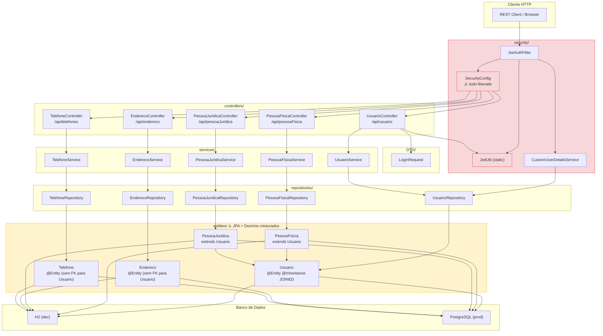
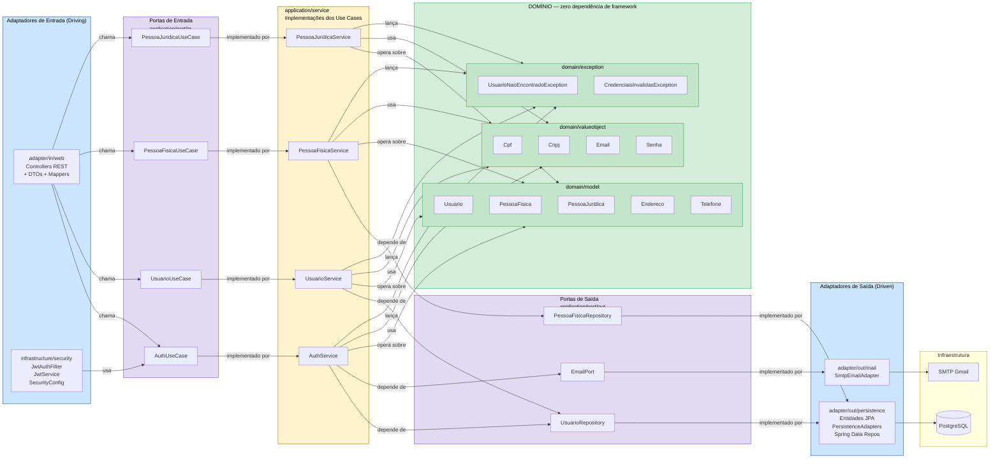
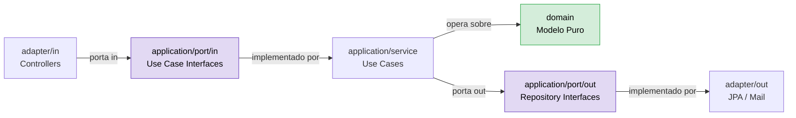

# Relatório de Arquitetura — Experience API
**Versão analisada:** v1 (atual) | **Proposta:** v2 — Monolito Hexagonal  
**Data:** Março/2026  

---

## 1. O que o projeto é hoje

API REST em Spring Boot 3.3.1 / Java 17 com as seguintes responsabilidades:

- Cadastro e autenticação de **Usuários** (base polimórfica)
- Cadastro de **Pessoa Física** (CPF)
- Cadastro de **Pessoa Jurídica** (CNPJ + Razão Social)
- Cadastro de **Endereços**
- Cadastro de **Telefones**
- Autenticação via **JWT** (jjwt 0.11.5 + auth0 java-jwt 4.5.0)
- Envio de e-mail via **Spring Mail** (SMTP Gmail)
- Banco de dados: **H2 em memória** (dev) / **PostgreSQL** (produção)

---

## 2. Estrutura atual (Arquitetura em Camadas — Layered)

```
controllers/        → HTTP, roteamento, serialização
services/           → Lógica de negócio (misturada com infra)
repositories/       → Acesso a dados (JPA/Spring Data)
entities/           → Modelo de domínio (anotado com JPA)
security/           → JWT, filtros, UserDetails
DTO/                → Apenas LoginRequest (incompleto)
```

Padrão atual: **Controller → Service → Repository → Entity**  
Estilo: Layered Architecture (3 camadas), sem separação entre domínio e infraestrutura.

### Diagrama — Arquitetura v1 (atual)



---

## 3. Inventário detalhado — O que foi encontrado

### 3.1 Entidades

| Entidade       | Herança          | Observações |
|----------------|------------------|-------------|
| `Usuario`      | Base (`@Inheritance JOINED`) | Mistura anotações JPA + Bean Validation + Lombok `@Data` + getters manuais duplicados |
| `PessoaFisica` | extends Usuario  | Validação `@CPF` (Hibernate Validator BR) |
| `PessoaJuridica` | extends Usuario | Validação `@CNPJ`, campo `razaoSocial` |
| `Endereco`     | Independente     | Sem vínculo com Usuario (sem FK mapeada) |
| `Telefone`     | Independente     | Sem vínculo com Usuario (sem FK mapeada) |

### 3.2 Controllers

| Controller             | Rotas                        | Padrão de resposta |
|------------------------|------------------------------|--------------------|
| `UsuarioController`    | CRUD + `/login` + `/me`      | Inconsistente (mistura `ResponseEntity` e retorno direto) |
| `PessoaFisicaController` | CRUD                       | Mistura `ResponseEntity` e retorno direto |
| `PessoaJuridicaController` | CRUD                     | Idem |
| `EnderecoController`   | CRUD                         | Consistente com `ResponseEntity` |
| `TelefoneController`   | CRUD                         | Consistente com `ResponseEntity` |

### 3.3 Services

Todos os services são **CRUD puro** sem lógica de negócio real. Retornam `null` em vez de lançar exceções. Nenhum usa interface.

### 3.4 Repositories

Todos estendem `JpaRepository<T, Long>` sem queries customizadas, exceto `UsuarioRepository` que tem `findByEmail`.

### 3.5 Segurança

| Componente              | Situação |
|-------------------------|----------|
| `SecurityConfig`        | Libera `/**` para todos — autenticação inoperante na prática |
| `JwtUtil`               | Usa campo `static` com injeção via `@Value` — antipadrão perigoso |
| `JwtAuthFilter`         | Funcional, mas sem tratamento de exceção no parse do token |
| `CustomUserDetailsService` | Funcional, papel fixo `"USER"` hardcoded |

### 3.6 DTO

Apenas `LoginRequest`. Nenhum DTO de resposta existe — as entidades JPA são expostas diretamente na API (vazamento de modelo).

### 3.7 Configuração

| Item | Situação |
|------|----------|
| Banco | H2 em memória (dados perdidos ao reiniciar) |
| Senha de e-mail | **Exposta em texto puro** no `application.properties` |
| JWT secret | Exposto em texto puro no `application.properties` |
| Dois providers JWT | `jjwt` e `auth0 java-jwt` ambos no pom — redundância |
| `ddl-auto=update` | Perigoso em produção |

---

## 4. Problemas críticos identificados

### Segurança
- Credenciais (senha Gmail, JWT secret) commitadas no repositório em texto puro
- `SecurityConfig` libera `/**` — toda a API está desprotegida
- `JwtUtil` usa campo `static` inicializado via injeção de instância — race condition possível em contextos multi-thread na inicialização
- Entidades JPA expostas diretamente na API (senha hash pode vazar)

### Design
- `Endereco` e `Telefone` não têm FK para `Usuario` — dados órfãos, sem contexto de uso
- `Usuario` usa `@Data` do Lombok + getters manuais duplicados — conflito de geração de código
- Services retornam `null` em vez de `Optional` ou exceções — força verificação de nulo em todo lugar
- Nenhum service usa interface — impossível mockar ou trocar implementação
- Lógica JWT no `UsuarioController` (deveria estar no service/security)
- `PessoaFisicaService` e `PessoaJuridicaService` não têm método `update`

### Qualidade
- Código comentado em `TelefoneController` (lixo de código)
- Inconsistência no padrão de resposta HTTP entre controllers
- Sem tratamento global de exceções (`@ControllerAdvice`)
- Sem paginação nos endpoints de listagem
- Zero testes além do placeholder gerado pelo Spring Initializr

---

## 5. Proposta — Arquitetura Hexagonal (v2)

### Conceito central

A Arquitetura Hexagonal (Ports & Adapters) isola o **domínio** de qualquer detalhe de infraestrutura. O domínio não conhece Spring, JPA, HTTP ou banco de dados.

### Diagrama — Arquitetura v2 (hexagonal proposta)



### Regra de dependência (seta = "depende de")



O domínio nunca importa nada de `adapter`, `infrastructure` ou Spring.

### 5.1 Estrutura de pacotes proposta

```
com.senai.experience/
│
├── domain/                          ← NÚCLEO — zero dependência de framework
│   ├── model/
│   │   ├── Usuario.java             ← POJO puro
│   │   ├── PessoaFisica.java
│   │   ├── PessoaJuridica.java
│   │   ├── Endereco.java
│   │   └── Telefone.java
│   ├── valueobject/
│   │   ├── Cpf.java                 ← Validação encapsulada no VO
│   │   ├── Cnpj.java
│   │   ├── Email.java
│   │   └── Senha.java               ← Encapsula hash
│   └── exception/
│       ├── UsuarioNaoEncontradoException.java
│       └── CredenciaisInvalidasException.java
│
├── application/                     ← CASOS DE USO
│   ├── port/
│   │   ├── in/                      ← Driving Ports (o que a app oferece)
│   │   │   ├── UsuarioUseCase.java
│   │   │   ├── PessoaFisicaUseCase.java
│   │   │   └── AuthUseCase.java
│   │   └── out/                     ← Driven Ports (o que a app precisa)
│   │       ├── UsuarioRepository.java
│   │       ├── PessoaFisicaRepository.java
│   │       └── EmailPort.java
│   └── service/                     ← Implementações dos Use Cases
│       ├── UsuarioService.java
│       ├── PessoaFisicaService.java
│       └── AuthService.java
│
├── adapter/                         ← ADAPTADORES
│   ├── in/
│   │   └── web/                     ← REST Controllers
│   │       ├── UsuarioController.java
│   │       ├── PessoaFisicaController.java
│   │       ├── dto/                 ← DTOs de entrada e saída
│   │       │   ├── LoginRequest.java
│   │       │   ├── LoginResponse.java
│   │       │   ├── UsuarioResponse.java
│   │       │   └── CriarPessoaFisicaRequest.java
│   │       └── mapper/              ← Conversão DTO ↔ Domain
│   │           └── UsuarioMapper.java
│   └── out/
│       ├── persistence/             ← Implementação JPA dos Driven Ports
│       │   ├── UsuarioJpaRepository.java
│       │   ├── UsuarioEntity.java   ← Entidade JPA separada do domínio
│       │   └── UsuarioPersistenceAdapter.java
│       └── mail/
│           └── SmtpEmailAdapter.java
│
├── infrastructure/                  ← Configurações Spring
│   ├── security/
│   │   ├── SecurityConfig.java
│   │   ├── JwtService.java          ← Substitui JwtUtil (sem static)
│   │   └── JwtAuthFilter.java
│   └── config/
│       └── BeanConfig.java
│
└── ExperienceApplication.java
```

### 5.2 Regras de dependência

```
adapter/in  →  application/port/in  →  application/service  →  domain
adapter/out →  application/port/out ←  application/service
```

O domínio nunca importa nada de `adapter`, `infrastructure` ou Spring.

---

## 6. Melhorias prioritárias para a v2

### Críticas (fazer antes de qualquer outra coisa)

1. **Mover credenciais para variáveis de ambiente** — usar `${MAIL_PASSWORD}` e `${JWT_SECRET}` no `application.properties`, nunca valores em texto puro
2. **Corrigir `SecurityConfig`** — remover o `requestMatchers("/**").permitAll()` que anula toda a segurança
3. **Separar entidades JPA do modelo de domínio** — nunca expor `@Entity` diretamente na API
4. **Criar DTOs de resposta** — especialmente para `Usuario` (nunca retornar `senhaHash`)
5. **Substituir retorno `null` por `Optional` ou exceções de domínio**

### Importantes

6. **Criar interfaces para todos os services** (ports de entrada)
7. **Mapear FK entre `Usuario` ↔ `Endereco` e `Usuario` ↔ `Telefone`**
8. **Criar `@ControllerAdvice` global** para tratamento de exceções
9. **Refatorar `JwtUtil`** — remover campo `static`, injetar via construtor
10. **Remover uma das libs JWT** — manter apenas `jjwt` ou `auth0`, não as duas
11. **Criar Value Objects** para CPF, CNPJ, Email — validação no domínio, não na entidade JPA
12. **Padronizar respostas HTTP** — todos os controllers usando `ResponseEntity`

### Qualidade

13. **Adicionar paginação** (`Pageable`) nos endpoints de listagem
14. **Remover código comentado** (`TelefoneController`)
15. **Criar testes unitários** para os use cases (domínio puro, sem Spring)
16. **Criar testes de integração** para os adapters
17. **Configurar profiles** (`dev`, `prod`) com `application-dev.properties` e `application-prod.properties`
18. **Trocar `ddl-auto=update` por `validate`** em produção, usar Flyway/Liquibase para migrations

---

## 7. Comparativo v1 vs v2

| Aspecto | v1 (atual) | v2 (hexagonal) |
|---------|-----------|----------------|
| Acoplamento | Alto (JPA nas entidades de domínio) | Baixo (domínio puro) |
| Testabilidade | Difícil (depende de Spring) | Alta (domínio sem framework) |
| Segurança | Crítica (tudo liberado, credenciais expostas) | Corrigida |
| DTOs | Ausentes (entidades expostas) | Completos (entrada e saída) |
| Exceções | `null` retornado | Exceções de domínio tipadas |
| Troca de banco | Difícil | Trivial (novo adapter) |
| Troca de protocolo | Difícil | Trivial (novo adapter de entrada) |

---

## 8. Próximos passos sugeridos

1. Criar o esqueleto da nova estrutura de pacotes
2. Migrar as entidades para POJOs de domínio + criar entidades JPA separadas
3. Definir as interfaces de porta (in/out) para cada agregado
4. Implementar os use cases com as regras de negócio reais
5. Implementar os adapters (REST + JPA + Mail)
6. Corrigir a configuração de segurança
7. Adicionar testes unitários dos use cases
8. Configurar Flyway para migrations
9. Configurar profiles dev/prod
10. Remover credenciais do repositório (e rotacionar as expostas)
