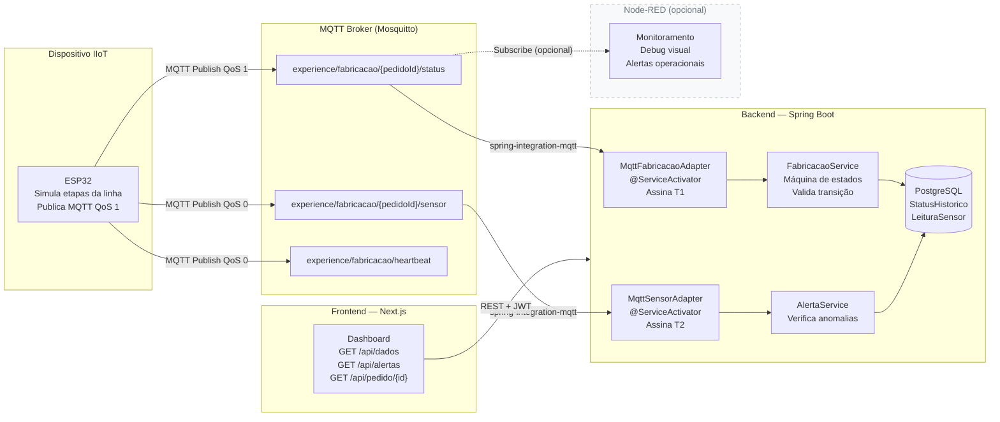
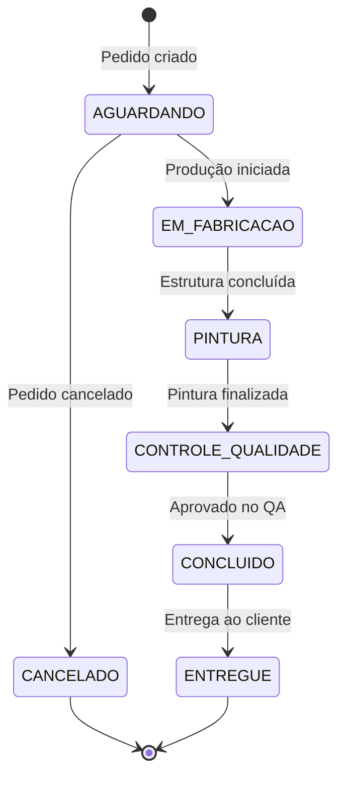
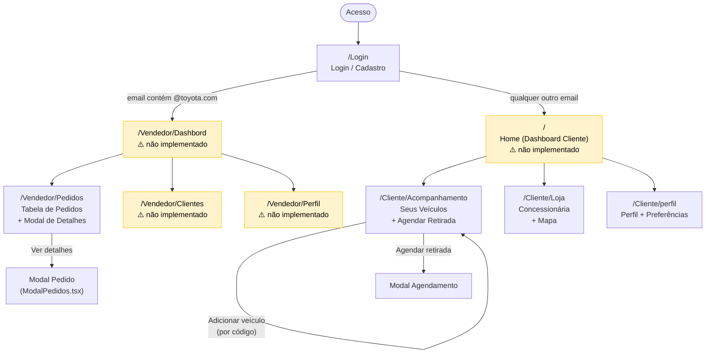
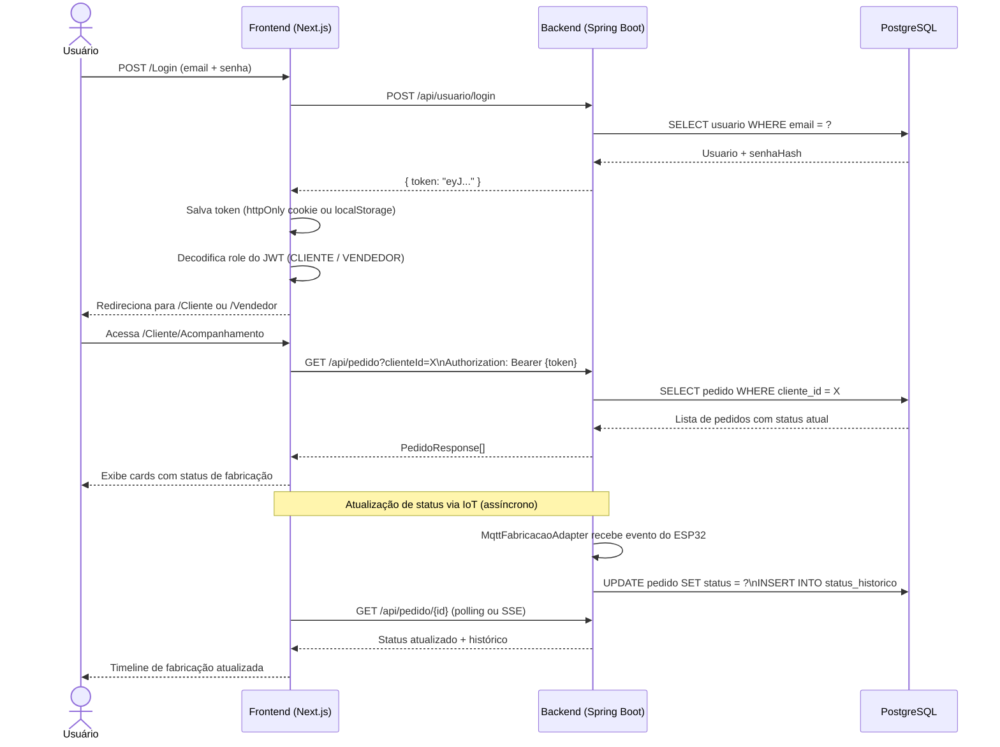

# Relatório de Arquitetura — Experience v2 (Monolito Hexagonal)

> Projeto: Sistema de Acompanhamento de Pedidos de Veículos — SENAI Experience  
> Versão analisada: v1 (Spring Boot MVC Tradicional)  
> Versão proposta: v2 (Monolito com Arquitetura Hexagonal)  
> Data: 30/03/2026  

---

## 1. Diagnóstico da Versão Atual (v1)

### 1.1 Stack Identificada

| Componente        | Tecnologia                          |
|-------------------|-------------------------------------|
| Framework         | Spring Boot 3.3.1                   |
| Linguagem         | Java 17                             |
| Persistência      | Spring Data JPA + Hibernate         |
| Banco             | PostgreSQL                          |
| Segurança         | Spring Security + JWT (jjwt 0.11.5 + auth0 4.5.0) |
| Validação         | Jakarta Validation + Hibernate Validator |
| E-mail            | Spring Mail (SMTP Gmail)            |
| Build             | Maven                               |
| Utilitários       | Lombok 1.18.30                      |

### 1.2 Estrutura de Pacotes Atual

```
com.senai.experience
├── controllers/        ← Camada HTTP (REST)
├── services/           ← Lógica de negócio
├── repositories/       ← Acesso a dados (Spring Data JPA)
├── entities/           ← Modelos JPA
├── DTO/                ← Apenas LoginRequest
└── security/           ← JWT + Spring Security
```

### 1.3 Entidades Mapeadas

| Entidade        | Tabela           | Observações                                              |
|-----------------|------------------|----------------------------------------------------------|
| `Usuario`       | `usuario`        | Superclasse com herança JOINED. Possui autenticação JWT. |
| `PessoaFisica`  | `pessoa_fisica`  | Herda de Usuario. Valida CPF (Hibernate Validator).      |
| `PessoaJuridica`| `pessoa_juridica`| Herda de Usuario. Valida CNPJ + Razão Social.            |
| `Pedido`        | `tb_pedido`      | Contém idCliente e idVendedor como `int` primitivo.      |
| `Endereco`      | `tb_endereco`    | Entidade independente, sem FK para Usuario.              |
| `Telefone`      | `tb_telefone`    | Entidade independente, sem FK para Usuario.              |

### 1.4 Endpoints Disponíveis

| Método | Rota                    | Descrição                        |
|--------|-------------------------|----------------------------------|
| GET    | /api/pedido             | Listar todos os pedidos          |
| GET    | /api/pedido/{id}        | Buscar pedido por ID             |
| GET    | /api/usuario            | Listar usuários                  |
| POST   | /api/usuario/login      | Autenticação (retorna JWT)       |
| GET    | /api/usuario/me         | Dados do usuário autenticado     |
| CRUD   | /api/pessoaFisica       | CRUD Pessoa Física               |
| CRUD   | /api/pessoaJuridica     | CRUD Pessoa Jurídica             |
| CRUD   | /api/endereco           | CRUD Endereço                    |
| CRUD   | /api/telefones          | CRUD Telefone                    |

---

## 2. Problemas Identificados na v1

### 2.1 Críticos

- **Credenciais expostas no código-fonte**: `application.properties` contém senha de e-mail Gmail em texto puro e chave JWT hardcoded. Risco de segurança grave em repositório versionado.
- **Banco PostgreSQL configurado**: Banco de produção único, sem H2.
- **Dois providers JWT simultâneos**: `jjwt` (0.11.5) e `auth0 java-jwt` (4.5.0) coexistem no `pom.xml`. Apenas o `jjwt` é utilizado. Dependência morta e risco de conflito.
- **`JwtUtil` com estado estático**: A chave JWT é armazenada em campo `static`, o que quebra o contrato de injeção de dependência do Spring e dificulta testes.

### 2.2 Arquiteturais

- **Entidades JPA expostas diretamente nas APIs**: Controllers recebem e retornam `@Entity` diretamente. Qualquer mudança no modelo de banco impacta o contrato da API.
- **Ausência de relacionamentos JPA**: `Pedido` referencia `idCliente` e `idVendedor` como `int` primitivo, sem `@ManyToOne`. `Endereco` e `Telefone` não possuem FK para `Usuario`.
- **Herança `JOINED` sem discriminação de papel**: `Usuario` não possui campo de role/perfil além do hardcoded `"USER"` no `CustomUserDetailsService`. Impossível diferenciar cliente de vendedor.
- **`SecurityConfig` libera tudo**: `.requestMatchers("/**").permitAll()` torna o JWT ineficaz para proteção de rotas.
- **Services sem tratamento de exceção**: Todos os services retornam `null` quando o recurso não é encontrado, em vez de lançar exceções tipadas.
- **Mistura de estilos de injeção**: Alguns controllers usam `@Autowired` (field injection), outros usam construtor. Inconsistência que dificulta testes unitários.
- **Ausência de DTOs de resposta**: Apenas `LoginRequest` existe como DTO. Todos os demais endpoints expõem a entidade completa, incluindo `senhaHash`.
- **Sem paginação**: Todos os `findAll()` retornam listas completas sem paginação, inviável em produção.
- **Sem tratamento global de erros**: Nenhum `@ControllerAdvice` / `@ExceptionHandler` global.
- **Sem camada de domínio real**: A lógica de negócio está nos services, mas eles operam diretamente sobre entidades JPA, sem objetos de domínio ricos.

### 2.3 Funcionais (para o contexto do produto)

- **Sem foco em acompanhamento**: A entidade `Pedido` não possui campos de status de fabricação nem histórico de transições. O sistema atual não serve ao propósito principal de permitir que o cliente visualize o andamento da fabricação e entrega do veículo.
- **Sem módulo de Dashboard**: Nenhuma entidade ou endpoint para notícias/conteúdo da marca exibido no painel do cliente.
- **Sem auditoria**: Nenhum campo de `createdAt` / `updatedAt` / `createdBy` nas entidades.
- **Sem separação de frontend**: Não há definição de onde o frontend reside, como consome a API ou como é servido.

---

## 3. Arquitetura Proposta — v2 (Monolito Hexagonal)

### 3.1 Conceito

A Arquitetura Hexagonal (Ports & Adapters) isola o núcleo de domínio de qualquer detalhe de infraestrutura. O domínio não conhece Spring, JPA, HTTP ou banco de dados. Ele expõe **portas** (interfaces) e a infraestrutura fornece **adaptadores** (implementações).

O sistema é composto por quatro camadas externas distintas:

- **Dispositivo IoT** (ESP32): simula a linha de produção e publica eventos de status via MQTT no broker.
- **Broker MQTT** (Mosquitto): recebe e distribui as mensagens. Ponto central de comunicação assíncrona.
- **Backend** (este projeto — monolito hexagonal): **assina diretamente o broker MQTT** via `spring-integration-mqtt`. Processa os eventos, aplica regras de negócio, persiste e expõe via REST.
- **Frontend** (SPA Next.js): consome a API REST via HTTP/JWT. Exibe dashboard com status de fabricação, consulta de pedidos e notícias da marca.

> O Node-RED é uma ferramenta auxiliar opcional para monitoramento e debug do fluxo MQTT, mas **não é um componente obrigatório** do pipeline. O backend não depende dele para funcionar.

```mermaid
graph TB
subgraph DISPOSITIVO["🔧 DISPOSITIVO IoT"]
        ESP32["ESP32\n(Simulador Linha de Produção)\nPublica via MQTT"]
    end

    subgraph BROKER["📡 BROKER MQTT (Mosquitto)"]
        MQ["Tópicos:\nexperience/fabricacao/{pedidoId}/status\nexperience/fabricacao/{pedidoId}/sensor\nexperience/fabricacao/heartbeat"]
    end

    subgraph NODERED_OPT["🔍 Node-RED (opcional — monitoramento)"]
        NR["Assina tópicos\nVisualiza fluxo\nDebug / alertas"]
    end

    subgraph FRONTEND["🖥️ FRONTEND (SPA — Next.js)"]
        DASH["Dashboard\n(Status Fabricação\n+ Notícias da Marca)"]
        PEDIDOS_UI["Consulta de Pedidos"]
        AUTH_UI["Login / Perfil"]
    end

    subgraph BACKEND["⬡ BACKEND — Monolito Hexagonal (Spring Boot)"]

        subgraph ENTRADA["Adaptadores de Entrada"]
            MQTT_IN["MQTT Listener\n(MqttFabricacaoAdapter)\nspring-integration-mqtt\nAssina broker diretamente"]
            REST_CLI["REST — Cliente\n(AcompanhamentoController\nDashboardController)"]
            REST_AUTH["REST — Auth\n(UsuarioController)"]
            REST_DADOS["REST — Dados IoT\nGET /api/dados\nGET /api/alertas"]
        end

        subgraph CORE["Núcleo Hexagonal"]
            subgraph PORTS_IN["Portas de Entrada (Use Cases)"]
                PUC["AcompanhamentoPedidoUseCase"]
                FUC["FabricacaoUseCase"]
                CUC["ClienteUseCase"]
                DUC["DashboardUseCase"]
                AUC["AlertaUseCase"]
            end

            subgraph DOMAIN["Domínio Puro"]
                PED["Pedido"]
                VEI["Veiculo"]
                CLI["Cliente"]
                STA["StatusFabricacao\n(Enum)"]
                HIS["StatusHistorico"]
                SEN["LeituraSensor"]
                NOT["Noticia"]
            end

            subgraph PORTS_OUT["Portas de Saída (Interfaces)"]
                PRP["PedidoRepositoryPort"]
                CRP["ClienteRepositoryPort"]
                VRP["VeiculoRepositoryPort"]
                FRP["FabricacaoRepositoryPort"]
                SRP["SensorRepositoryPort"]
                NRP["NoticiaRepositoryPort"]
                MLP["MailPort"]
            end
        end

        subgraph SAIDA["Adaptadores de Saída"]
            JPA["JPA Adapters\n(PostgreSQL)"]
            SMTP["SMTP Adapter"]
            DB[("PostgreSQL")]
        end

        subgraph INFRA["Infraestrutura Transversal"]
            SEC["Security\n(JWT + Spring Security)"]
            APP["DTOs + Mappers"]
            MQTTCFG["MqttConfig\n(ConnectionFactory\nMessageChannel)"]
        end

    end

    ESP32 -->|"MQTT Publish\nQoS 1"| MQ
    MQ -->|"MQTT Subscribe\n(spring-integration-mqtt)"| MQTT_IN
    MQ -.->|"Subscribe (opcional)"| NR

    DASH -->|"GET /api/dashboard\nGET /api/pedido"| REST_CLI
    PEDIDOS_UI -->|"GET /api/pedido/:id"| REST_CLI
    AUTH_UI -->|"POST /api/usuario/login"| REST_AUTH
    DASH -->|"GET /api/dados\nGET /api/alertas"| REST_DADOS

    MQTT_IN --> FUC
        REST_CLI --> PUC
        REST_CLI --> DUC
    REST_DADOS --> AUC
    REST_AUTH --> CUC

    PUC --> PED
    FUC --> STA
    FUC --> HIS
    FUC --> SEN
    AUC --> HIS
    CUC --> CLI
    DUC --> NOT
    PED --> VEI

    PRP --> JPA
    CRP --> JPA
    VRP --> JPA
    FRP --> JPA
    SRP --> JPA
    NRP --> JPA
    MLP --> SMTP
    JPA --> DB

    MQTTCFG -.->|configura| MQTT_IN
    SEC -.->|protege| REST_CLI
    SEC -.->|protege| REST_DADOS
    APP -.->|transforma| PUC
    APP -.->|transforma| FUC

    style NODERED_OPT fill:#f8f9fa,stroke:#adb5bd,color:#6c757d,stroke-dasharray: 5 5
    style DISPOSITIVO fill:#d4edda,stroke:#28a745,color:#000
    style BROKER fill:#cce5ff,stroke:#004085,color:#000
```



### 3.2 Estrutura de Pacotes Proposta

```
com.senai.experience
│
├── domain/                          ← NÚCLEO — zero dependência de framework
│   ├── model/
│   │   ├── Pedido.java
│   │   ├── Veiculo.java
│   │   ├── Cliente.java
│   │   ├── Vendedor.java
│   │   ├── Noticia.java
│   │   ├── LeituraSensor.java       ← Dado bruto do ESP32 (deviceId, valor, timestamp)
│   │   ├── StatusFabricacao.java    ← Enum: AGUARDANDO, EM_FABRICACAO, PINTURA, QUALIDADE, CONCLUIDO, ENTREGUE
│   │   └── StatusHistorico.java
│   │
│   ├── port/
│   │   ├── in/
│   │   │   ├── AcompanhamentoPedidoUseCase.java  ← consulta status e histórico
│   │   │   ├── FabricacaoUseCase.java   ← chamado pelo MqttFabricacaoAdapter
│   │   │   ├── ClienteUseCase.java
│   │   │   ├── DashboardUseCase.java
│   │   │   └── AlertaUseCase.java       ← GET /api/alertas
│   │   └── out/
│   │       ├── PedidoRepositoryPort.java
│   │       ├── ClienteRepositoryPort.java
│   │       ├── VeiculoRepositoryPort.java
│   │       ├── FabricacaoRepositoryPort.java
│   │       ├── SensorRepositoryPort.java    ← persiste leituras brutas
│   │       ├── NoticiaRepositoryPort.java
│   │       └── MailPort.java
│   │
│   └── service/
│       ├── PedidoService.java
│       ├── FabricacaoService.java
│       ├── ClienteService.java
│       ├── DashboardService.java
│       └── AlertaService.java
│
├── application/
│   ├── dto/
│   │   ├── request/
│   │   │   └── LoginRequest.java
│   │   └── response/
│   │       ├── PedidoResponse.java
│   │       ├── StatusFabricacaoResponse.java
│   │       ├── ClienteResponse.java
│   │       ├── DashboardResponse.java
│   │       ├── LeituraSensorResponse.java   ← GET /api/dados
│   │       └── NoticiaResponse.java
│   └── mapper/
│       ├── PedidoMapper.java
│       ├── ClienteMapper.java
│       └── SensorMapper.java
│
├── infrastructure/
│   ├── mqtt/                            ← NOVO — integração MQTT
│   │   ├── MqttConfig.java              ← ConnectionFactory, MessageChannel, QoS, broker URL
│   │   ├── MqttFabricacaoAdapter.java   ← @ServiceActivator — assina tópico de status
│   │   └── MqttSensorAdapter.java       ← @ServiceActivator — assina tópico de sensores
│   │
│   ├── persistence/
│   │   ├── entity/
│   │   │   ├── PedidoEntity.java
│   │   │   ├── VeiculoEntity.java
│   │   │   ├── ClienteEntity.java
│   │   │   ├── StatusHistoricoEntity.java
│   │   │   ├── LeituraSensorEntity.java
│   │   │   └── NoticiaEntity.java
│   │   ├── repository/
│   │   │   ├── PedidoJpaRepository.java
│   │   │   ├── ClienteJpaRepository.java
│   │   │   ├── FabricacaoJpaRepository.java
│   │   │   ├── SensorJpaRepository.java
│   │   │   └── NoticiaJpaRepository.java
│   │   └── adapter/
│   │       ├── PedidoRepositoryAdapter.java
│   │       ├── ClienteRepositoryAdapter.java
│   │       ├── FabricacaoRepositoryAdapter.java
│   │       ├── SensorRepositoryAdapter.java
│   │       └── NoticiaRepositoryAdapter.java
│   │
│   ├── mail/
│   │   └── SmtpMailAdapter.java
│   │
│   └── security/
│       ├── JwtUtil.java
│       ├── JwtAuthFilter.java
│       ├── SecurityConfig.java
│       └── CustomUserDetailsService.java
│
└── adapter/
    └── rest/
        ├── AcompanhamentoController.java  ← GET /api/pedido, GET /api/pedido/{id}
        ├── DashboardController.java
        ├── DadosController.java         ← GET /api/dados, GET /api/alertas
        └── UsuarioController.java
```

### 3.3 Módulos Funcionais da v2

#### Módulo 1 — Acompanhamento de Pedidos
Responsável pela consulta e visualização do status dos pedidos de veículos. Os pedidos são criados externamente (ex: concessionária, sistema legado) e registrados no sistema para acompanhamento.

- Consultar pedido por ID ou por cliente
- Listar pedidos com filtros e paginação
- Visualizar histórico de status de fabricação e entrega

#### Módulo 2 — Fabricação (MQTT direto no backend)

O backend assina o broker MQTT diretamente via `spring-integration-mqtt`. Não há intermediário HTTP obrigatório — o evento sai do ESP32, passa pelo broker e chega ao `MqttFabricacaoAdapter` dentro do Spring Boot.

**Fluxo completo:**



**Definições da Camada MQTT (4.2):**

| Item | Definição |
|------|-----------|
| Broker | Mosquitto (local, porta 1883) |
| QoS status | 1 — at least once (garante entrega da mudança de etapa) |
| QoS sensor | 0 — at most once (leituras contínuas, perda aceitável) |
| QoS heartbeat | 0 — sinal de vida periódico |
| Retenção | `retain=true` no tópico de status (último estado sempre disponível) |
| Autenticação broker | usuário/senha configurados no `mosquitto.conf` |

**Estrutura de tópicos MQTT (4.1):**
```
experience/fabricacao/{pedidoId}/status    ← mudança de etapa (QoS 1, retain)
experience/fabricacao/{pedidoId}/sensor    ← leitura de sensor (QoS 0)
experience/fabricacao/heartbeat            ← sinal de vida do ESP32 (QoS 0)
```

**Payload MQTT — status (ESP32 → Broker → Backend):**
```json
{
  "deviceId": "ESP32-linha-01",
  "pedidoId": 4821,
  "etapa": "PINTURA",
  "timestamp": "2026-03-27T14:30:00Z"
}
```

**Payload MQTT — sensor (ESP32 → Broker → Backend):**
```json
{
  "deviceId": "ESP32-linha-01",
  "pedidoId": 4821,
  "temperatura": 78.5,
  "vibracao": 1.2,
  "timestamp": "2026-03-27T14:30:05Z"
}
```

**Dependência a adicionar no `pom.xml`:**
```xml
<!-- MQTT via Spring Integration -->
<dependency>
    <groupId>org.springframework.integration</groupId>
    <artifactId>spring-integration-mqtt</artifactId>
</dependency>
<dependency>
    <groupId>org.springframework.boot</groupId>
    <artifactId>spring-boot-starter-integration</artifactId>
</dependency>
```

**Configuração mínima (`application.properties`):**
```properties
mqtt.broker.url=tcp://localhost:1883
mqtt.broker.username=experience
mqtt.broker.password=senha_mqtt
mqtt.client.id=backend-experience
mqtt.topic.status=experience/fabricacao/+/status
mqtt.topic.sensor=experience/fabricacao/+/sensor
```

**Endpoints REST expostos (4.3):**

| Método | Rota | Descrição |
|--------|------|-----------|
| GET | /api/dados | Lista leituras de sensores (paginado) |
| GET | /api/dados/{pedidoId} | Leituras de um pedido específico |
| GET | /api/alertas | Lista alertas gerados por anomalias |
| GET | /api/fabricacao/{pedidoId}/historico | Histórico de transições de status |

**Máquina de estados da fabricação:**



#### Módulo 3 — Clientes
Gestão de clientes PF e PJ com seus dados de contato.

- Cadastro com validação de CPF/CNPJ
- Associação de endereços e telefones ao cliente (FK real)
- Perfis: CLIENTE, VENDEDOR, ADMIN

#### Módulo 4 — Dashboard
Agrega dados para o painel do cliente no frontend. Não possui domínio próprio — é um use case de leitura que compõe dados de outros módulos.

- Retorna status atual de fabricação do pedido do cliente autenticado
- Retorna lista de notícias da marca (conteúdo editorial simples)
- Endpoint único: `GET /api/dashboard` — resposta agregada com status do pedido + notícias
- Notícias: CRUD admin via `POST/PUT/DELETE /api/noticias`, listagem pública paginada

> O sistema não permite que o cliente crie ou altere pedidos. O papel do cliente é exclusivamente visualizar o andamento da fabricação e entrega do veículo já adquirido.

#### Módulo 5 — Autenticação
- Login com JWT
- Roles: `ROLE_CLIENTE`, `ROLE_VENDEDOR`, `ROLE_ADMIN`
- Refresh token
- Proteção de rotas por role

---

## 4. Frontend — Inventário e Integração na Arquitetura

### 4.1 Stack do Frontend

| Item | Tecnologia |
|------|-----------|
| Framework | Next.js (App Router) |
| Linguagem | TypeScript |
| Estilo | Tailwind CSS |
| Ícones | Lucide React |
| Roteamento | Next.js file-based routing |
| Auth (atual) | `localStorage` (simulado, sem JWT real) |

### 4.2 Telas Existentes

| Tela | Rota | Perfil | Status |
|------|------|--------|--------|
| Login / Cadastro | `/Login` | Público | Implementado (mock — sem chamada real à API) |
| Acompanhamento de Veículos | `/Cliente/Acompanhamento` | Cliente | Implementado (dados hardcoded) |
| Concessionária (Loja) | `/Cliente/Loja` | Cliente | Implementado (endereço fixo hardcoded) |
| Perfil do Cliente | `/Cliente/perfil` | Cliente | Implementado (lê email do localStorage) |
| Pedidos do Vendedor | `/Vendedor/Pedidos` | Vendedor | Implementado (dados hardcoded) |
| Dashboard (home) | `/` | Cliente | Referenciado na Sidebar, não mapeado |
| Dashboard Vendedor | `/Vendedor/Dashbord` | Vendedor | Referenciado no nav, não mapeado |
| Clientes do Vendedor | `/Vendedor/Clientes` | Vendedor | Referenciado no nav, não mapeado |
| Perfil do Vendedor | `/Vendedor/Perfil` | Vendedor | Referenciado no nav, não mapeado |

### 4.3 Componentes Compartilhados

| Componente | Uso |
|-----------|-----|
| `SideBar.tsx` | Navegação do cliente (mobile bottom bar + desktop icon bar) |
| `ModalPedidos.tsx` | Modal de detalhes de pedido (cliente) |
| `Card.tsx` | Componente genérico de card |
| Sidebar inline em `Vendedor/Pedidos` | Sidebar do vendedor embutida diretamente na página (não reutilizável) |

### 4.4 Diagrama de Navegação



### 4.5 Problemas Identificados no Frontend

**Críticos**
- Autenticação completamente simulada — o login não chama `/api/usuario/login`, apenas salva o email no `localStorage`. Qualquer email/senha funciona.
- Roteamento de perfil baseado em `email.includes("@toyota.com")` — frágil e inseguro. O papel do usuário deve vir do JWT retornado pelo backend.
- Dados de pedidos, clientes e status hardcoded em todos os componentes — nenhuma tela consome a API real.

**Arquiteturais**
- Sem camada de serviço/cliente HTTP centralizado — cada tela deveria ter um `service` ou `api client` para isolar as chamadas ao backend.
- Sidebar do vendedor duplicada inline em `Vendedor/Pedidos` em vez de usar um componente reutilizável.
- `ModalPedidos.tsx` importado como `NewsModal` em `Vendedor/Pedidos` — nome inconsistente.
- Sem gerenciamento de estado global (sem Context API, Zustand ou similar) — estado de autenticação espalhado via `localStorage`.
- Sem variável de ambiente para a URL base da API (`NEXT_PUBLIC_API_URL`).

**Funcionais**
- Tela de acompanhamento adiciona veículo por "código" mas não define o que é esse código nem como ele se relaciona com o `id` do pedido no backend.
- Agendamento de retirada exibe `alert()` — não persiste nada.
- Perfil do cliente exibe nome fixo "Lauren" — não busca dados reais do usuário autenticado.
- Telas `/Vendedor/Dashbord`, `/Vendedor/Clientes` e `/Vendedor/Perfil` são referenciadas na navegação mas não existem.

### 4.6 Integração Frontend ↔ Backend na v2



### 4.7 Estrutura de Pastas Sugerida para o Frontend (v2)

```
frontend/
├── app/
│   ├── (auth)/
│   │   └── login/page.tsx
│   ├── cliente/
│   │   ├── acompanhamento/page.tsx
│   │   ├── loja/page.tsx
│   │   └── perfil/page.tsx
│   ├── vendedor/
│   │   ├── dashboard/page.tsx
│   │   ├── pedidos/page.tsx
│   │   ├── clientes/page.tsx
│   │   └── perfil/page.tsx
│   └── layout.tsx
├── components/
│   ├── Sidebar/
│   │   ├── SidebarCliente.tsx
│   │   └── SidebarVendedor.tsx
│   ├── Modal/
│   │   ├── ModalPedido.tsx
│   │   └── ModalAgendamento.tsx
│   └── Card.tsx
├── services/              ← Camada de chamadas HTTP
│   ├── api.ts             ← axios/fetch base com interceptor JWT
│   ├── pedidoService.ts
│   ├── usuarioService.ts
│   └── fabricacaoService.ts
├── hooks/
│   ├── useAuth.ts         ← Lê/valida JWT, expõe role
│   └── usePedidos.ts
├── types/
│   ├── Pedido.ts
│   ├── Usuario.ts
│   └── StatusFabricacao.ts
└── .env.local
    └── NEXT_PUBLIC_API_URL=http://localhost:8080
```

---

## 5. Novas Entidades Necessárias

### `Veiculo`
```java
// Campos sugeridos
Long id
String modelo
String marca
String cor
BigDecimal preco
String imagemUrl
boolean disponivel
```

### `Pedido` (expandido)
```java
// Pedido registrado externamente, acompanhado pelo cliente via app
Long id
Cliente cliente
Veiculo veiculo
StatusFabricacao status
LocalDateTime dataPedido
LocalDateTime dataEntregaPrevista
List<StatusHistorico> historico
```

### `StatusHistorico`
```java
Long id
Pedido pedido
StatusFabricacao statusAnterior
StatusFabricacao statusNovo
LocalDateTime alteradoEm
String alteradoPor
```

### `Noticia`
```java
Long id
String titulo
String resumo
String conteudo
String imagemUrl
LocalDateTime publicadoEm
boolean ativo
```

---

## 5. Plano de Migração v1 → v2

### Fase 1 — Fundação (sem quebrar a v1)
1. Criar estrutura de pacotes hexagonal
2. Criar objetos de domínio puros (sem anotações JPA)
3. Definir interfaces de porta (`in` e `out`)
4. Criar DTOs de request/response para todos os endpoints

### Fase 2 — Infraestrutura
5. Criar `@Entity` separadas dos objetos de domínio
6. Implementar adapters JPA que implementam as portas de saída
7. Criar mappers domínio ↔ entidade JPA ↔ DTO
8. Migrar `application.properties` para variáveis de ambiente (`.env`)
9. Confirmar PostgreSQL como banco principal (já configurado)

### Fase 3 — Domínio e Casos de Uso
10. Implementar `AcompanhamentoPedidoService` com consultas por cliente e histórico de status
11. Implementar `FabricacaoService` com máquina de estados (atualizado via MQTT, não pelo cliente)
12. Adicionar entidades `Veiculo`, `StatusHistorico`, `Noticia`
13. Corrigir relacionamentos JPA (FKs reais)

### Fase 4 — Integração MQTT
14. Adicionar dependências `spring-integration-mqtt` e `spring-boot-starter-integration`
15. Criar `MqttConfig.java` com `ConnectionFactory`, `MessageChannel` e assinatura dos tópicos
16. Implementar `MqttFabricacaoAdapter` com `@ServiceActivator` que chama `FabricacaoUseCase`
17. Implementar `MqttSensorAdapter` para leituras brutas de sensores
18. Configurar Mosquitto localmente e testar com cliente MQTT (ex: MQTTX)
19. Testar fluxo completo: ESP32 → Mosquitto → Spring Boot → PostgreSQL

### Fase 5 — Frontend e Dashboard
18. Definir SPA (framework a escolher) consumindo a API REST via JWT
19. Implementar `DashboardController` com resposta agregada (status + notícias)
20. Implementar tela de consulta de pedido, status de fabricação e notícias

### Fase 6 — Segurança e Qualidade
21. Unificar para um único provider JWT (remover `auth0 java-jwt`)
22. Refatorar `JwtUtil` para ser um `@Component` sem estado estático
23. Implementar roles reais (`ROLE_CLIENTE`, `ROLE_VENDEDOR`, `ROLE_ADMIN`, `ROLE_IOT`)
24. Proteger rotas por role no `SecurityConfig`
25. Adicionar `@ControllerAdvice` global com tratamento de exceções
26. Adicionar paginação em todos os endpoints de listagem
27. Remover credenciais do `application.properties` (usar variáveis de ambiente)

---

## 6. Dependências a Adicionar no pom.xml

```xml
<!-- MQTT via Spring Integration -->
<dependency>
    <groupId>org.springframework.boot</groupId>
    <artifactId>spring-boot-starter-integration</artifactId>
</dependency>
<dependency>
    <groupId>org.springframework.integration</groupId>
    <artifactId>spring-integration-mqtt</artifactId>
</dependency>

<!-- MapStruct para mapeamento domínio ↔ DTO ↔ Entity -->
<dependency>
    <groupId>org.mapstruct</groupId>
    <artifactId>mapstruct</artifactId>
    <version>1.5.5.Final</version>
</dependency>

<!-- Flyway para migrations de banco -->
<dependency>
    <groupId>org.flywaydb</groupId>
    <artifactId>flyway-core</artifactId>
</dependency>

<!-- Springdoc OpenAPI (Swagger UI) -->
<dependency>
    <groupId>org.springdoc</groupId>
    <artifactId>springdoc-openapi-starter-webmvc-ui</artifactId>
    <version>2.5.0</version>
</dependency>
```

### Dependências a Remover

```xml
<!-- REMOVER: duplicidade de JWT -->
<dependency>
    <groupId>com.auth0</groupId>
    <artifactId>java-jwt</artifactId>
    <version>4.5.0</version>
</dependency>
```

---

## 7. Resumo das Prioridades

| Prioridade | Item                                              | Impacto       |
|------------|---------------------------------------------------|---------------|
| CRÍTICO    | Remover credenciais do application.properties     | Segurança     |
| CRÍTICO    | Configurar PostgreSQL como banco principal        | ~~Resolvido~~ |
| CRÍTICO    | Adicionar entidade Veiculo e status de fabricação ao Pedido | Funcional     |
| ALTO       | Separar DTOs das entidades JPA                    | Arquitetura   |
| ALTO       | Definir contrato payload MQTT (ESP32 → Backend)   | IoT           |
| ALTO       | Implementar MqttConfig + adapters MQTT            | Funcional     |
| ALTO       | Corrigir relacionamentos JPA (FKs reais)          | Dados         |
| ALTO       | Implementar roles e proteger rotas                | Segurança     |
| MÉDIO      | Implementar DashboardController (status + notícias) | Funcional   |
| MÉDIO      | Definir e implementar SPA frontend                | Produto       |
| MÉDIO      | Adicionar paginação nos endpoints de listagem     | Performance   |
| MÉDIO      | Implementar @ControllerAdvice global              | Qualidade     |
| BAIXO      | Unificar provider JWT (remover auth0)             | Limpeza       |
| BAIXO      | Adicionar Flyway para migrations                  | Operacional   |


---

## 8. Avaliação de Conformidade — Requisitos Arquiteturais (Entrega 1)

> Comparação entre a arquitetura proposta neste documento e os requisitos do documento de referência da UC de Integração com IIoT.

---

### 8.1 Matriz de Conformidade

| # | Requisito | Status | Observação |
|---|-----------|--------|------------|
| 2.1 | Arquitetura em Camadas (Coleta → Comunicação → Processamento → Persistência → Apresentação) | ✅ Conforme | As 5 camadas estão mapeadas: ESP32 (coleta), MQTT+Node-RED (comunicação), Spring Boot (processamento), PostgreSQL (persistência), Next.js (apresentação) |
| 2.2 | Baixo Acoplamento — módulos independentes via API/protocolo | ✅ Conforme | Cada camada se comunica via MQTT ou REST. O backend não conhece o ESP32 diretamente. O frontend não conhece o banco. |
| 2.3 | Alta Coesão — cada camada com responsabilidade única | ✅ Conforme | Hexagonal garante isso no backend. Frontend, Node-RED e ESP32 têm responsabilidades isoladas. |
| 2.4 | Escalabilidade (sensores, usuários, volume de dados) | ⚠️ Parcial | A arquitetura permite escalar, mas não há definição de estratégia de indexação, retenção histórica ou política de cache. |
| 2.5 | Interoperabilidade — MQTT, JSON, REST | ✅ Conforme | MQTT definido com estrutura de tópicos. Payloads em JSON documentados. API REST mapeada. |
| 3 | Visão Macro: IoT → Broker → Backend → Banco → Cloud → Mobile → Interface Industrial | ⚠️ Parcial | Camada Cloud e Interface Industrial não estão definidas. O documento não especifica ambiente de deploy nem dashboard operacional industrial. |
| 4.1 | Camada IoT: estrutura de tópicos, frequência, payload | ✅ Conforme | Tópicos MQTT definidos (`experience/fabricacao/{pedidoId}/status`), payload documentado com `deviceId`, `etapa` e `timestamp`. |
| 4.2 | Camada MQTT: QoS, retenção, nomenclatura de tópicos | ⚠️ Parcial | Nomenclatura definida. QoS e política de retenção não especificados. |
| 4.3 | Camada Backend: Controller, Service, Repository + endpoints POST /dados, GET /dados, GET /alertas | ⚠️ Parcial | Controller, Service e Repository presentes. Endpoints de fabricação mapeados. Falta endpoint `GET /alertas` — não há módulo de alertas definido. |
| 4.4 | Camada Persistência: banco, indexação, retenção histórica | ⚠️ Parcial | PostgreSQL definido. `StatusHistorico` modela o histórico. Estratégia de indexação e retenção não documentadas. |
| 4.5 | Camada Cloud: hospedagem, versionamento, controle de acesso | ❌ Ausente | Nenhuma definição de ambiente de deploy (Railway, Render, AWS, etc.), estratégia de CI/CD ou controle de acesso em nível de infraestrutura. |
| 4.6 | Camada Mobile/App: arquitetura do app, estado, autenticação | ✅ Conforme | Frontend Next.js documentado com estrutura de pastas, camada de serviços, hooks de autenticação, gerenciamento de estado e integração JWT. |
| 4.7 | Interface Industrial: KPIs, indicadores de tendência, alertas visuais, hierarquia visual | ❌ Ausente | O Dashboard do cliente cobre visualização de status, mas não há definição de interface industrial com KPIs, indicadores de tendência ou alertas visuais para operadores de linha. |
| 5.1 | Integração Vertical: dado bruto → informação → indicador → decisão | ⚠️ Parcial | O fluxo ESP32 → Node-RED → Backend → Frontend cobre dado bruto → informação. Indicadores e suporte a decisão não estão modelados. |
| 5.2 | Integração Horizontal: API integrável com Produção, Manutenção, Logística, TI | ⚠️ Parcial | A API REST é aberta para integração futura, mas não há documentação de endpoints (Swagger/OpenAPI) nem mapa de integração horizontal explícito. |
| 6 | Modelo híbrido: Camadas + SOA + Event-Driven (MQTT assíncrono + REST síncrono) | ✅ Conforme | O sistema usa MQTT assíncrono (ESP32 → Node-RED) e REST síncrono (Node-RED → Backend, Frontend → Backend). |
| 7 | Segurança: autenticação API, autorização por perfil, criptografia, proteção MQTT, controle mobile | ⚠️ Parcial | JWT + roles definidos. Token de serviço para IoT definido. Proteção do broker MQTT (autenticação no Mosquitto) e criptografia de dados em trânsito (HTTPS/TLS) não documentadas. |
| 8 | Requisitos Não Funcionais: disponibilidade, escalabilidade, performance, confiabilidade, manutenibilidade | ⚠️ Parcial | Mencionados implicitamente na arquitetura, mas sem SLAs, metas de latência ou estratégias formais documentadas. |
| 9.1 | Artefato: Diagrama geral da arquitetura | ✅ Conforme | Diagrama Mermaid `graph TB` presente na seção 3.1 |
| 9.2 | Artefato: Diagrama de fluxo de dados | ✅ Conforme | Diagrama `flowchart LR` do pipeline IoT presente na seção 3.3 (Módulo 2) |
| 9.3 | Artefato: Diagrama de camadas | ⚠️ Parcial | As camadas estão descritas textualmente e no diagrama geral, mas não há um diagrama dedicado exclusivamente à visão de camadas (Coleta → Comunicação → Processamento → Persistência → Apresentação) |
| 9.4 | Artefato: Modelo de dados inicial | ⚠️ Parcial | Entidades descritas em Java (seção 5), mas sem diagrama ER formal |
| 9.5 | Artefato: Estrutura de tópicos MQTT | ✅ Conforme | Tópicos documentados na seção 3.3 (Módulo 2) |
| 9.6 | Artefato: Estrutura da API | ⚠️ Parcial | Endpoints listados na seção 1.4, mas sem especificação OpenAPI/Swagger formal |
| 9.7 | Artefato: Mapa de integração vertical e horizontal | ⚠️ Parcial | Integração vertical coberta pelo diagrama de sequência (seção 4.6). Integração horizontal não tem mapa dedicado. |

---

### 8.2 Resumo por Status

| Status | Quantidade | Itens |
|--------|-----------|-------|
| ✅ Conforme | 9 | Camadas, acoplamento, coesão, interoperabilidade, IoT payload, modelo híbrido, diagrama geral, fluxo IoT, tópicos MQTT |
| ⚠️ Parcial | 12 | Escalabilidade, visão macro, MQTT QoS, backend endpoints, persistência, mobile, integração vertical/horizontal, segurança, RNFs, diagrama de camadas, modelo ER, API spec |
| ❌ Ausente | 2 | Camada Cloud (deploy), Interface Industrial (KPIs/alertas operacionais) |

---

### 8.3 Lacunas a Endereçar para Conformidade Total

**1. Camada Cloud — deploy e infraestrutura**
Definir ambiente de hospedagem (ex: Railway, Render, AWS EC2), estratégia de CI/CD (GitHub Actions), HTTPS obrigatório e política de backup do PostgreSQL.

**2. Interface Industrial**
Criar definição de dashboard operacional para a linha de produção: KPIs (unidades/hora, tempo médio por etapa), indicadores de tendência, alertas visuais de anomalia e hierarquia visual clara (linha → máquina → sensor). Pode ser uma tela separada no frontend com role `ROLE_OPERADOR`.

**3. QoS e retenção MQTT**
Documentar: QoS 1 (at least once) para eventos de status, QoS 0 para heartbeat. Política de retenção: `retain=true` no último status de cada pedido.

**4. Diagrama de camadas dedicado**
Adicionar diagrama Mermaid exclusivo mostrando as 5 camadas em sequência vertical: Coleta → Comunicação → Processamento → Persistência → Apresentação.

**5. Diagrama ER**
Adicionar modelo entidade-relacionamento com `Pedido`, `Veiculo`, `Cliente`, `StatusHistorico`, `Noticia` e suas cardinalidades.

**6. Especificação OpenAPI**
Gerar ou documentar os contratos de API (pelo menos os endpoints críticos: `/api/fabricacao/status`, `/api/pedido`, `/api/dashboard`, `/api/usuario/login`).

**7. Requisitos Não Funcionais formais**
Documentar metas: latência máxima de resposta da API, disponibilidade esperada, volume máximo de mensagens MQTT por minuto, política de retenção de histórico de fabricação.

**8. Segurança do Broker MQTT**
Definir autenticação no Mosquitto (usuário/senha ou certificado TLS), ACLs por tópico e uso de TLS para comunicação ESP32 → Broker.

---

### 8.4 Pontuação Geral

```
✅ Conforme:  9 / 23 = 39%
⚠️ Parcial:  12 / 23 = 52%
❌ Ausente:   2 / 23 =  9%

Cobertura efetiva (conforme + parcial): 91%
Conformidade total: 39%
```

A arquitetura está bem fundamentada nos aspectos de domínio, pipeline IoT e frontend, mas precisa endereçar as lacunas de infraestrutura cloud, interface industrial e artefatos formais (ER, OpenAPI, diagrama de camadas) para atingir conformidade total com os requisitos da Entrega 1.
