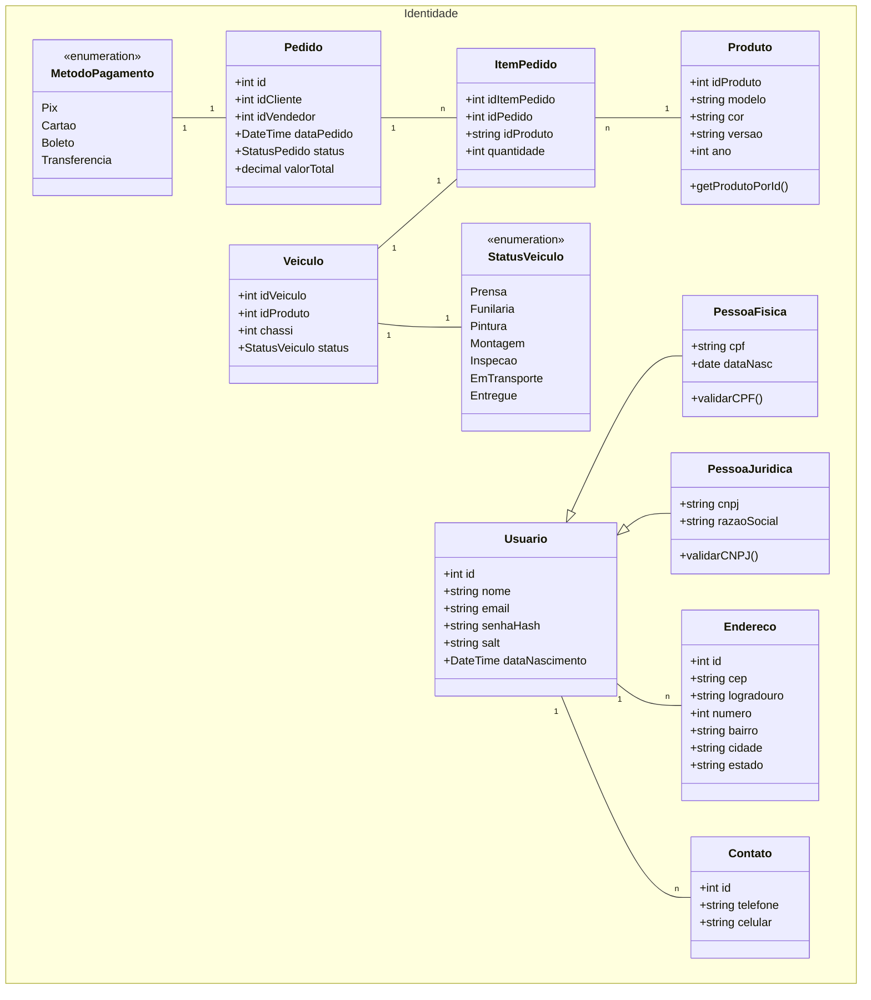

# Diagrama de Classes (Toyota Experience - Arquitetura de Microsserviços)

> Este documento detalha a estrutura de classes dividida por domínios, otimizada para uma arquitetura de microsserviços.

---

## 🔐 1. Microsserviço de Identidade (Customer & Auth)

Responsável por gerenciar os usuários, autenticação e informações de contato.

### **Core de Usuário (PF e PJ)**

---

## 🏗️ Diferenciais da Nova Modelagem (Para o TCC)

* **Especialização de Clientes:** A distinção entre **Pessoa Física** e **Pessoa Jurídica** utiliza herança de `Usuario`, permitindo que ambos herdem credenciais de login e endereços, mas mantenham validações específicas (CPF vs CNPJ).
* **Desacoplamento de Domínio:** O `Pedido` não possui mais a classe `Usuario` ou `Vendedor` inteira dentro dele. Ele utiliza apenas **Ids de Referência** (`compradorIdRef` e `vendedorIdRef`), permitindo que o banco de dados de Vendas seja independente do banco de Identidade.
* **Consolidação de Contato:** As classes separadas de telefone e e-mail foram consolidadas na entidade `Contato`, simplificando a manutenção e reduzindo o número de tabelas.
* **Controle de Integridade:** O `Veiculo` possui `StatusVeiculo`, impedindo que um mesmo veículo seja vendido mais de uma vez.
* **Uso de Enumerações:** Status e métodos de pagamento utilizam enums, evitando inconsistência de dados.

---

